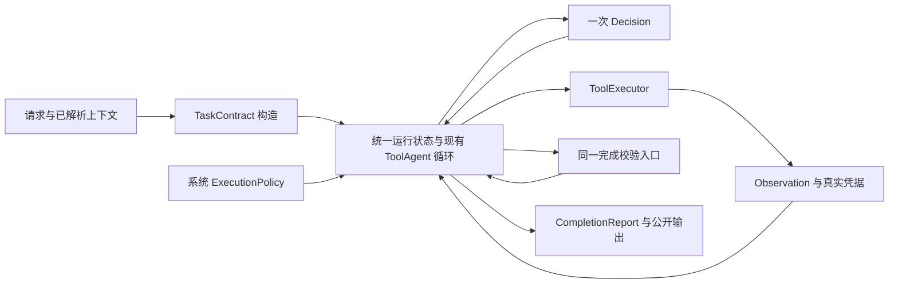

# Engineering Task / Evidence / Execution Contract v2

状态：**DRAFT / 待评审，尚未实现**。日期：2026-10-02。

项目所有者在函数读取切片完成并比较旧版之后，授权开始契约设计。本文件是下一阶段的候选设计与实施计划；当前产品代码、5/4/2 行为和历史冻结结论继续以现有实现为准。本设计不晋升已有 Release 2.0 验收结果。

## 1. 设计结论

保留现有一个 Decision → Tool → Observation 循环，收敛四个边界：

| 契约 | 回答的问题 | 权威来源 |
|---|---|---|
| TaskContract | 用户要求交付什么，每项需要什么来源与范围？ | 模型解释请求，系统校验并冻结；权限和预算由系统另行提供 |
| EvidenceRecord / ToolReceipt | 实际读到了什么、执行了什么，哪个版本与范围支持哪个陈述？ | 真实工具/检索结果，由系统登记身份与事实；内容仍是不可信数据 |
| ExecutionPolicy / Usage | 还允许进行什么动作、花多少资源，什么时候停止？ | 服务端配置与唯一运行账本 |
| CompletionReport | 哪些交付项已满足可检验义务，哪些缺失，为什么停止？ | 同一个完成校验入口，由系统生成报告 |

**5/4/2 是默认执行配置，不再成为引擎类型的永久最大值。** 扩展配置仍有有限上限、实际调用计数、deadline 与权限检查。模型不能加额度，预算耗尽也不能当作任务成功或不安全请求。

当前只读能力可在这套契约中演进，未来修改代码、运行测试复用同一个循环与完成入口。新增能力通过权限和实际执行凭据进入，不通过第二套 Agent 或特批恢复循环进入。

## 2. 直接依据与当前差异

依据：[系统覆盖评估](../validation/2026-10-02-system-assessment.md)、[函数读取对比](../validation/2026-10-02-source-reading-v2.md)和归档原始观察。

| 已观察问题 | 当前责任缺口 | 候选改动 |
|---|---|---|
| C02/C03 计算成功仍误拒答 | 知识 QueryPlan 不表达工程交付项；计算结果不是 public evidence；`bool(evidence)` 触发全局引用义务 | 计算交付项由 calculator 凭据支持，无关知识不能制造该项的引用义务 |
| C13 计算完成、知识缺失却 completed | 没有按交付项记录部分完成 | 分别记录计算项与知识项，报告 partial 和缺项 |
| R01/R03/N01 旧版遗漏末尾 | 有一个 project_code 不等于已覆盖目标实现 | 使用目标与真实读取范围判定覆盖，复用 v2 reader |
| R05 读全后仍过度保证 | 结构引用不能证明自然语言语义或答案正确性 | 标注校验层级，保留源码语义审查，不把 completed 当作质量 PASS |
| N03/C04 引用调用点越界 | 合法 E-ID 不证明该路径/行的调用关系 | 陈述绑定具体对象与实际证据范围；跨对象关系要有对应位置的材料 |
| 4 工具可能不足以查完整任务 | 数值上限写死在 `ToolAgentBudget` 的类型校验中 | 系统选择有限 profile，同一个账本执行全部配置 |
| 未来编辑后需再次运行相同测试 | 当前 duplicate key 只有 tool name + canonical arguments | 后续将读取/执行所依赖的工作区版本纳入重复判断 |

另一个本次源码审查事实：`runtime.py::_evidence_from_project_context` 把正文裁至 2000 字符，但仍保留原读取的起止行；reader v2 每次可返回 8000 字符。现有 Decision 可以看到更长的原始 Observation，公开 snippet 却只是前缀。**实际观察范围、公开摘要范围和可引用的原始内容必须分开**，不能因为摘要保留了末行编号，就认定摘要包含末尾正文。

该新审查事实不重算上一轮以实际观察为依据的诊断成绩，也没有真实复现一项新的产品失败。

代码依据：[预算类型](../../core/tool_agent/runtime_models.py)、[唯一循环及证据转换](../../core/tool_agent/runtime.py)、[统一装配](../../core/unified_engineering_runtime.py)、[结构要求](../../core/engineering_requirements.py)、[引用绑定](../../core/engineering_verification.py)、[执行器](../../core/tool_agent/executor.py)、[公开 schema](../../api/schemas.py)。

## 3. 唯一控制流与职责替换



UnifiedEngineeringRuntime 负责装配。循环可继续位于现有 ToolAgentRuntime；不在外层再实现一个循环。校验器不执行工具、不调用模型、不自行重试。

| 当前组件 | 迁移职责 |
|---|---|
| EngineeringEvidencePlanner + Requirement Router | 新路径由一个 TaskContract 构造入口替代两处工程任务解释；知识 QueryPlan 只负责知识检索子计划 |
| EngineeringRetrievalComponent | 执行确实需要的知识计划；仓库任务不因知识未命中被全局拒绝 |
| ToolAgentBudget / DecisionControlState | 统一 policy 与 usage 的受控投影；只有一个计数权威 |
| 工具 Observation → evidence 转换 | 登记来源、对象、版本、可用正文与精确截断；不能只按 kind 增加计数 |
| BoundEngineeringEvidenceVerifier / finalization seam | 同一入口做交付项、引用范围及执行凭据校验；反馈具体缺项 |
| API / SSE / 会话 | 投影统一报告；不独立判断成功，不以传输结束替代业务完成 |

新路径不把旧 Router 与新 TaskContract 结果叠加成两套工程要求。迁移期间 v1 仅作为明确的兼容适配，历史 G3/G12 的模型、测试与冻结资产保留。候选 v2 不修改这些历史事实。

新入口还需要按能力报告 readiness：Task producer、policy、执行内核缺失仍 fail fast；知识 backend 可作为明确的 `unavailable` 能力登记。纯计算或仓库项不依赖 knowledge-ready，要求知识的项明确报告该能力缺口。不能让一个冻结 corpus 的不可用隐式使全部 v2 请求不可用，也不能用未验证语料冒充知识来源。这属于切片 B 的装配变化，当前产品仍有固定 verified corpus 依赖。

## 4. TaskContract：先明确交付项

最小字段：`contract_id`、`version`、`resolved_request`、`workspace_id`、`objectives[]`。每项包含系统分配的 ID、用户请求中的依据、交付描述、所需来源、覆盖要求和目标线索。

初版上限建议为 8 项交付项，16 条最终陈述；这是候选 schema 的容量约束，不是自动删题规则。无法在上限内表示请求时，应说明需要拆分，不静默丢弃要求。

| 来源要求 | 有效支持 | 无法替代它的材料 |
|---|---|---|
| reasoning | 无外部事实的问候、重述或明确标识的推断 | 未读取的当前仓库事实、声称已执行的结果 |
| computation | 与本次表达式一致的 calculator 成功结果 | 任意知识片段或模型自报数值 |
| knowledge | 相关知识材料的实际正文 | 检索命中数、同类 E-ID、模型记忆冒充本次资料 |
| repository | 绑定项目的代码/文档/变更/测试静态内容 | 与项目无关的知识文档 |
| execution（未来启用） | 当前工作区版本下真实运行、退出状态及检查结果 | 测试文件、命令建议、旧版本的运行日志 |

覆盖要求只保留四种语义：`local_fact`（局部常量/条件）、`implementation`（目标实现）、`relation`（对象间关系）、`executed_check`（实际执行）。不能对全部仓库问题强制读完整函数；查看一个常量时有限行窗可以足够。跨文件问题也不以“任意读两个文件”作为完成证明。

多来源请求分为不同交付项。例如“计算 37×29 并解释 IDF”含计算项和知识项。知识项缺失不能抹掉 1073 的真实计算结果，也不能把缺失项算作完成。

### 构造规则

1. 模型可建议目标与来源需求，系统校验 schema、数量、用户请求依据与当前能力；模型建议不是权限或完成证明。
2. 本轮先复用既有 Planner 的一次调用位置，用新 TaskContract producer 替代工程路径的旧解释。不要在旧 Planner 和 Router 之外再追加一轮分类 LLM。
3. 知识需求从交付项聚合；`none` 不调用知识检索，`required` 只约束对应项，`optional` 检索失败不阻止无关项交付。QueryPlan 的字段组合仍由既有 parser 验证。
4. 模型输出非法时，不自动把所有请求降成 BM25；保留原请求，返回 `TASK_CONTRACT_INVALID` 的明确未完成结果。初版不新增 Task producer 的解析修复调用；Decision 既有的一次解析修复仍必须计入 provider 上限。后续是否让简单请求跳过 Planner，单独实验。
5. 合同在 run 内冻结。调查时可细化目标定位信息，不可删除必需交付项、降低执行检查要求或放宽 policy。
6. 请求含糊或要求当前能力不存在时，报告具体不确定项或能力缺口；必要时在下一用户回合澄清，不通过猜测产生完成状态。

“系统校验并冻结”只保证形式、来源边界和身份一致，不保证模型把所有自然语言需求都理解对；此项必须进入语义验收。

## 5. EvidenceRecord 与 ToolReceipt：记录真实范围和版本

沿用真实 E-ID 及五类已有材料，初步新增 `computation_result`；`execution_result` 只在未来实际运行工具上线时启用。代码材料与测试执行结果是不同来源，不能互换。

EvidenceRecord 至少有：`evidence_id`、`kind`、`producer_call_id`、`workspace_id`（知识侧为 corpus 身份）、`source_revision`、`locator`、`coverage`、`content_ref`、`preview`。

- ID 与来源元数据由系统从注册工具/检索结果登记；模型或项目正文不能自己签发。
- 正文保持不可信，不能变成 system 指令、预算配置或 Tool 权限。
- revision 使用**与读取同一份快照**计算的文件/正文哈希，不能事后重读当前文件来给旧内容补一个新哈希。
- `coverage` 描述实际返回的行、被截断的行/字符，以及选中函数范围。多页仅在同一对象、同一文件版本下可合并；行连续也不代表被裁切的长行完整。
- reader 的 `content_complete` 是来源完整度，不是任务完成度。false 不必然禁止局部事实；true 不必然支持调用者、其他属性或自然语言保证。
- `preview` 可以维持短摘要，但必须另有摘要范围与截断标记。引用校验和证据展开读取有界的原始内容，而非把摘要当成全部来源。
- run 内存只保留有界观察，容量由允许调用次数与各 producer 的单次上限推导。超限时记录缺口，不隐式读取整仓库或无限存档。
- 跨会话不能复用裸 E-ID；必须重新绑定工作区/语料版本。先做 run-local 存储，持久化与证据展开需随 API 阶段一起设计。

ToolReceipt 记录真实调用、参数摘要、结果状态、输入版本、输出版本/影响及执行检查。calculator 凭据含规范化表达式与有限数值。未来测试凭据含命令/检查身份、工作目录、代码版本、退出码、超时/取消和有界输出；补丁凭据含前后版本及实际 diff。

“测试通过”只能表示声明范围内的命令在对应版本真实通过。测试发现不等于运行，命令退出 0 也不能证明任意性质或全项目正确。

## 6. ExecutionPolicy：将数值从类型上限移入配置

最小策略字段：`policy_id`、`capabilities`、`max_decisions`、`max_tool_calls`、`max_tool_errors`、`max_provider_calls`、`deadline_seconds`、`max_parse_repairs_per_call`。保留既有 prompt/context/单次输出的有限大小。

| profile | 决策/工具/错误 | 总 provider 上限* | 时间 | 状态 |
|---|---|---:|---:|---|
| readonly_default_v1 | 5 / 4 / 2 | 12 | 60s | 新契约默认候选；数值沿用当前，但全链计数/deadline 行为需独立验证 |
| readonly_extended_candidate | 12 / 10 / 3 | 26 | 120s | 仅扩容实验，尚未启用；数值未证明最优 |
| workspace_edit_candidate | 待基于编辑/测试成本设定 | 必须有限 | 必须有限 | 工具、隔离与执行凭据未具备，不能启用 |

*总 provider 上限按上下文最多 1、任务解释最多 1、每次 Decision 最多 1 次初始调用 + 1 次既有解析修复计算。它是应用层实际请求的上限；SDK 隐式重试必须关闭或显式计入。更复杂规划不能偷偷获得额外调用。

当前 60s deadline 从 ToolAgent 阶段开始，现有公开 token 用量主要统计 Decision。新 policy 的全链 deadline 与全阶段用量是**计划中的行为变更**，不能说当前系统已经支持。

### 计数与停止规则

1. Unified run 创建唯一 usage，Context、Task producer、Retrieval、Decision 和 Tool 通过同一状态登记。有限检索保留自己的 producer 次数记录，仍受同一 deadline 与已批准上限，不构造第二个账本或循环。
2. 逻辑 Decision、实际 provider 请求、Tool 调用、Tool 错误分别计数；修复仍属于同一次逻辑 Decision，但消耗 provider 调用与 token。
3. 调用前保留额度，再 dispatch。计费请求发出后即使超时也计一次。进入 Executor 的调用即使返回 schema/权限/执行错误也计入工具尝试；预算或重复检测在 dispatch 前拦截不算已执行工具。
4. 最后一次可用 Decision 只能提交最终候选或说明缺项。不能执行一个新工具后再领取免费总结调用。
5. Guard 反馈可在剩余额度内修正答案或继续取证，不增加循环、不自动补额度。变化必须是新有效材料、对应项覆盖改善或确定校验错误减少；仅换措辞、ID 或无关材料不算进展。
6. 预算、deadline、重复调用、权限与 provider 故障均产生明确 stop reason。停止后由系统投影已有已验证部分，不为漂亮输出再启动 LLM。
7. 服务端选 profile。用户文本、模型动作和仓库内容不能填写上限；不能以“任务很复杂”为由临时特批。只读扩容先在同一批任务上比较 5/4 与候选配置。
8. 全链 deadline 从接纳 run 起用 monotonic clock；每次操作 timeout 不超过其剩余时间。取消和 deadline 都在调用前、返回后和最终提交前检查。协作式超时不等于能强行抢占线程；未来进程执行需另有终止/回收机制。
9. provider 未报告 token 时记录 unknown，不捏造数值。初期硬限靠实际调用数和既有单次输入/输出边界；没有准确计数与预留机制前，不宣称已实现精确金额限额。

### 重复调用与未来修改

纯计算以相同输入判重复；只读/测试调用以工具、规范化参数、相关 workspace/source revision 判重复。同一版本同一调用不能靠生成新 call_id 绕过。版本发生实际变化后允许重新读取/运行，仍消耗正常额度。版本必须由系统根据真实文件/变更确定，模型不可声明“版本变了”。

首次实现可用 workspace revision 的保守失效范围，之后再优化依赖指纹。修改工具不自动重放；需要执行前置版本检查与明确 receipt。重复守卫和幂等性不是同一个能力。

## 7. CompletionReport：逐项完成与执行停止分开

Decision 最终提交候选：按 objective_id 给出结构化陈述、`observed/inferred` 类型及具体证据引用。系统据此生成报告，不接受模型自填的 completed、权限或检查通过标志。公开答案由已接纳陈述和缺项说明渲染，不附加未声明的自由扩写。

完成校验逐项检查：用户请求项是否仍存在；来源是否正确；ID 是否真实且当前有效；引用位置是否落在实际可用内容；实现范围是否满足该项覆盖；执行凭据是否属于当前版本和所需检查。关系陈述不能只靠被调函数片段证明调用位置。

| completion.status | 含义 |
|---|---|
| completed | 必需交付项全部满足此版本可检验义务，最终提交成功，无未完成强制检查 |
| partial | 已有可交付的已验证部分，但有缺项、检查缺口或提交阻碍；具体列出 |
| incomplete | 尚无可交付的已验证部分，列出能力/证据/预算等缺口 |
| refused | 请求因明确权限/安全边界被拒绝；不能把普通预算耗尽伪装成安全拒绝 |

`execution.outcome` 独立表示 `finished / stopped / failed / denied`，带真实 reason。provider 故障可能发生在一部分交付之后，失败不应抹掉真实已验证部分；但取消/超时之后不能继续提交新的 completed。

检查与最终提交使用同一个 terminal barrier；terminal commit 恰好一次，检查 cancel/deadline/权限和版本。commit 之前不存在已提交 completed，commit 之后不因迟到回调改变结果。若所有陈述都有依据但最终提交被阻止，报告 partial 并在 `outstanding_constraints` 中说明提交阻碍，不伪造一个新的缺失用户问题。

状态交叉规则：completed 只配 finished；refused 只配 denied；partial/incomplete 可配 finished、stopped 或 failed，并提供相应缺项。终止必须有原因，传输 done 不生成业务成功。

校验层级必须诚实：初版 `verification_level=structural`、`semantic_assessment=not_assessed`。它可检查对象、位置、版本和凭据，不能自动证明任意自然语言语义。即使所有结构检查通过，R05 类“保证正确性”的过度陈述仍可能发生；必须通过语义验收衡量，不把新 schema 当成消灭幻觉的证明。后续只有新证据支持收益时才评估额外 semantic verifier 的成本。

### 部分完成示例（设计样例，非实际新运行）

```json
{
  "schema_version": "engineering_result_v2",
  "execution": {"outcome": "finished", "reason": null},
  "completion": {
    "status": "partial",
    "objective_results": [
      {"objective_id": "O1", "state": "fulfilled", "evidence_ids": ["E1"]},
      {"objective_id": "O2", "state": "missing", "reason": "KNOWLEDGE_SUPPORT_MISSING"}
    ],
    "outstanding_constraints": []
  },
  "verification": {"level": "structural", "semantic_assessment": "not_assessed"},
  "answer": "37 × 29 = 1073。当前取得的资料未支持 IDF 的解释，该部分尚未完成。"
}
```

示例 E1 必须来自真实 calculator 凭据；该 JSON 展示返回语义，不是允许客户端签发 evidence。

## 8. 当前只读与未来编辑的边界

初版 capabilities 只包含现有只读注册工具和计算。执行策略对工具做准入，模型负责在准入范围内决定下一步调查；不在 TaskContract 中固定一整套工具调用顺序。

未来编辑上线前必须具备：系统可验证的写入范围与前置版本、可审阅 diff、真实检查凭据、命令参数约束、环境与资源限制、可终止并回收的执行单元，以及实际的操作系统/容器隔离。**cwd 或路径字符串 allowlist 不能当成沙箱证明**。

修改后“完成”依赖该任务声明的检查策略。用户要求运行测试时，读测试文件或建议命令不满足该项；环境无法运行时报告“已修改、未验证”，不能说已修复。已通过测试的代码后来再改动时，原 receipt 对新版本失效。取消后也必须记录已发生的文件变更，不声称没有副作用。

本轮不定义一个空壳 sandbox 或启用 run_test，不把没有实现的执行能力作为当前可以完成的任务。

## 9. 版本与迁移切片

v1 endpoint、Action、公开 evidence kind 与结果不具备上述全部字段。不要把 partial 压成 completed，也不要把计算凭据伪装成 project_code。

候选公开入口为 `/engineering/v2/query` 与 `/engineering/v2/query/stream`，共享现有 facade 和唯一执行内核。v1 入口继续明确的兼容协议，不构造第二个循环。v2 请求仍只接受 question（会话入口另带现有会话身份），预算/权限/工作区由系统绑定。新接口是协议版本区分，不是第二种 Agent。

| 切片 | 内容 | 停止点与预计成本* |
|---|---|---|
| A | TaskContract / ExecutionPolicy / CompletionReport 数据模型；旧类型到默认 policy 的适配，唯一计数与终止不变量 | provider-free 验证完成，尚不启用扩容；约 1–2 个开发日 |
| B | 工程任务 producer 替代两处解释；按来源的能力 readiness；calculator 凭据；逐项缺口与部分完成；原 G3 QueryPlan 保留为知识子计划 | 先修 utility/mixed 根因，在候选路径做对比；约 2–4 日 |
| C | 精确范围/版本、原文与 preview 分离；结构化陈述与单一完成校验；发布 v2 HTTP/SSE/会话投影 | 旧/新全链与前端兼容检查，未晋升前保持候选；约 3–5 日 |
| D | 在同一 v2 内核上实验默认与 extended policy，评估额外资源是否改善真正完成度 | 稳定收益后才批准配置；约 1–2 日 |
| E | 编辑、隔离、运行检查与版本失效 | 单独立项与验收，不预估为上面几天内可以附带完成 |

*成本是基于当前源码边界的工作量估计，随评审和回归结果调整；不是实测工时承诺。建议先实现 A，再按 B/C 的根因顺序推进，不一次替换整条主链。数据模型设计不意味着为每个对象新建一个服务。

兼容与回滚：候选开关在 run 开始前选择协议/profile，一次 run 内不能切换或因失败静默降回旧 guard。保留 v1 作为明示回滚入口，停止新 v2 接纳后等待在途任务终结再回滚；已产生变更的未来写任务不能靠切入口回滚文件。v2 会话/事件需带 schema 身份，并检查旧 SQLite/客户端兼容，不能把新结果当旧消息解析。

## 10. 验收与未决项

设计反例见 [engineering_contract_v2_cases.json](engineering_contract_v2_cases.json)。它是实现前的期望矩阵，不是已运行测试，不报告“通过率”。

必须满足：

1. C02/C03 的真实计算不再因无关知识产生引用误拒答；C13 如实部分完成，不虚构 IDF 支持。
2. R01/R03/N01 的关键分支获取保留；R05 不把可选校验说成保证正确性；N02/N03/C04 的额外解释和关系引用接受逐句检查。
3. 函数/多页/长行截断、不同源码版本、preview 与原文差异均可解释；不强制所有局部事实读整函数。
4. 正常预算、解析修复、最后决策、超限、duplicate、取消、deadline、provider 缺 usage 都有可复现的正确计数与终止测试。
5. v1 API/SSE/会话与已有安全回归不退化；v2 单一 terminal 与断开清理仍正确。历史冻结目录不改写。
6. 先用已有诊断题找退化，再在未参与修改的新仓库/新问题上做独立验证。预先固定评价口径，保存所有失败，不取多次最优答案。

记录任务完成率、部分完成是否诚实、误拒答、无依据陈述、错误来源绑定、真实工具/provider 次数、全部阶段 tokens 与时延。总耗时或 completed 数单独上升不能作为晋升证据。扩容要比较同一组任务、同一模型、同一语料和同一契约，并记录输入/输出增加。

评审时需要收敛的三个选择：扩容 profile 的最终数字；v2 证据原文在会话中的有限持久化/展开方式；未来写任务采用哪种真正隔离的执行单元。它们不阻塞 A 的数据与默认预算不变量实现，但未决功能不能启用。

本设计的推荐首个实施切片是 A。**本次仅产出设计与反例，尚未修改生产代码、调用付费模型、实施沙箱或开始扩容实验。**
