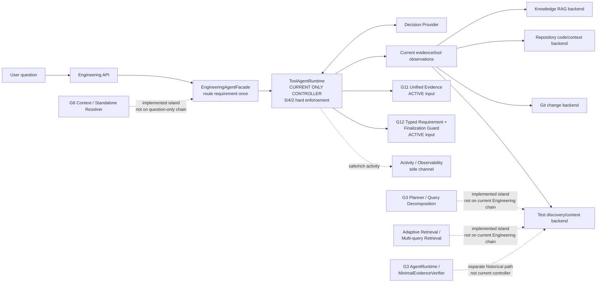
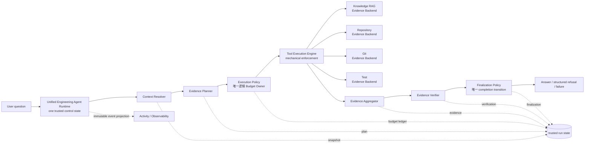

# Unified Engineering Runtime v1

> Architecture freeze: `ARCH-FREEZE-01`<br>
> Baseline: `0eef8ef9d6decdaa10efebe04087b06611654670` (`fix: isolate observability from runtime outcomes`)<br>
> Scope: design and audit only；本文不授权生产 Runtime、Prompt、Router、Guard 或 budget 修改。

## 1. Purpose and authority

本文件把 v7 的 Unified Evidence-Grounded Engineering Agent 结构落入仓库，定义当前实现与目标架构之间的边界，并作为 `ARCH-RUNTIME-02`～`ARCH-EVAL-08` 的唯一架构依据。

本文件冻结的是 ownership、控制状态、组件边界和迁移顺序，不声称目标架构已经完成实现。当前工作的正式问题是 **Architecture Integration Drift**：能力已经分别存在或被 Gate 验证，但没有全部进入同一条 Engineering 控制链。

本次 freeze 的硬边界：

- 纯设计 / 纯审计；不修改 `core/`、`api/`、`ui/` 等生产代码；
- 不修改 Prompt、Router、Guard、budget，不重跑 Formal；
- 不新增 Multi-Agent，不开始 Context / Planner migration coding；
- 不做 Persistence、Citation UI 或第三个产品 Runtime；
- 不永久废弃 G3，也不为了文档漂亮改写任何 frozen 结论。

## 2. Terms and invariants

### 2.1 Single Engineering Agent

用户面对的是一个 `Unified Engineering Agent Runtime`。Knowledge RAG、Repository、Git、Test 以及未来的其他取证系统都是 **Evidence Backend**，不是独立 Agent，不拥有自己的自主控制循环。

### 2.2 One trusted control state

一次 Engineering run 只有一个受信控制状态，至少包含：request、context snapshot、evidence plan、policy/budget ledger、tool observations、aggregated evidence、verification state、finalization state 和 safe activity projection。Provider 输出、Tool observation 和 backend 返回值都是不可信输入，必须通过既定 schema 和 component boundary 才能进入控制状态。

### 2.3 One logical budget owner

目标架构中只有一个逻辑 Budget Owner：`Execution Policy`。它负责定义一次 run 的 iteration、tool-call、tool-error、provider/retry 及相关成本边界；`Tool Execution Engine` 只执行和强制该 policy，不另建预算；Planner、Verifier、Facade 和 Provider 都不能创建或增加一套 budget。

迁移期间，`ToolAgentRuntime` 可以继续对既有主链执行 frozen `5/4/2` hard enforcement。此时它是 Unified Runtime 的 **execution component**，不是第二个 Agent/controller，也不是第二个逻辑 Budget Owner。

### 2.4 Frozen facts versus migration design

Gate 1～G12 的历史事实、artifact、指标、sealed/formal 状态和结论是只读输入。本文中的“迁移”表示复用和重新接线已有 component contract，不表示重做历史实验或重新解释历史结果。

## 3. Current Architecture

### 3.1 Actual Engineering main chain

当前 Engineering 产品入口的实际控制链是：

```text
/engineering/query (以及对应 stream endpoint)
        ↓
EngineeringAgentFacade
        ↓  route once: Typed Engineering Requirement
ToolAgentRuntime
        ↓  only actual Decision → Tool → Observation → Decision controller
7 bounded read-only Tools
        ├─ Knowledge RAG
        ├─ Repository code/context
        ├─ Git change
        ├─ Test discovery/context
        └─ calculator / utility
        ↓
G11 Unified Evidence + G12 Requirement/Finalization Guard
        ↓
Engineering response + Safe/Rich Activity projection
```

事实边界：

- 当前 Engineering 主链**实际由 `ToolAgentRuntime` 控制**；`EngineeringAgentFacade` 只是产品入口适配器和一次 requirement route，不是第二个 controller；
- G4 的 Tool loop、allowlist、duplicate-call handling、`5/4/2` hard enforcement 和 completion/refusal 语义在这条主链工作；
- G11 Unified Evidence 与 G12 Typed Requirement / Finalization Guard 当前为 **ACTIVE** 的整合输入，并未自动意味着整个目标控制面已经存在；
- safe trace / rich activity 是旁路投影。基线修复明确 observability 不得改变 runtime outcome。

### 3.2 Current architecture diagram



### 3.3 Drift statement

当前存在能力孤岛，而不是能力完全缺失：

1. G3 Planner、Query Decomposition、Adaptive Retrieval、Multi-query Retrieval 和 `MinimalEvidenceVerifier` 存在于历史实现/设计边界中，但没有进入当前 Engineering 主链；
2. G8 Context / Standalone Resolver 存在于 `core/conversation_context` 及其历史实验中，但当前 Engineering request contract 仍是 question-only，因此 resolver 未进入主链；
3. G1/G2 retrieval、G4 Tool Agent、G6 Repository Evidence、G9 failure semantics、G10 change/test tools 已分别可用，但控制权和 evidence lifecycle 仍以 ToolAgentRuntime 内部实现为中心；
4. G11 已提出统一 Evidence 语义，G12 已提供 Typed Requirement / Finalization Guard，但二者尚未和 Context、Plan、Retrieval、Verification 形成一个明确的统一控制面。

因此，当前系统不能被描述为“目标 Unified Runtime 已经上线”；准确描述是：**ToolAgentRuntime-backed Engineering product with active Unified Evidence and Requirement/Guard inputs**。

## 4. Target Architecture

目标不是再包一层 Agent，而是把已有能力迁移到一个统一控制面：

```text
Unified Engineering Agent Runtime
├── Context Resolver
├── Evidence Planner
├── Execution Policy
├── Tool Execution Engine
├── Evidence Aggregator
├── Evidence Verifier
├── Finalization Policy
└── Activity / Observability
```

### 4.1 Target architecture diagram



### 4.2 Component responsibilities

| Component | Sole responsibility | Explicit non-responsibility |
|---|---|---|
| Context Resolver | 生成 bounded、可审计的 context snapshot，并保留 question-only 兼容入口 | 不做 retrieval policy，不拥有 tool loop |
| Evidence Planner | 把 question + context 转成 bounded evidence plan、subquery 和 evidence obligations | 不执行 Tool，不直接决定 completed |
| Execution Policy | 定义唯一 run policy、预算 ledger、allowlist、iteration 和 stop conditions | 不生成 evidence，不拥有第二个 Agent loop |
| Tool Execution Engine | 按 policy 调用已注册 Evidence Backend，执行 schema、重复调用、错误与硬 budget enforcement | 不自行规划，不改变 finalization 结论 |
| Evidence Aggregator | 规范化、去重、合并来自不同 backend 的 evidence，并保留 provenance/citation identity | 不把“调用过”当成证据充分，不批准完成 |
| Evidence Verifier | 检查 evidence shape、citation、必要 coverage 和可验证约束 | 不凭空补 evidence，不重写历史 Gold |
| Finalization Policy | 生成/接受最终 answer、refusal 或 typed failure，并执行唯一 completion transition | 不发起自主 Tool loop，不拥有额外预算 |
| Activity / Observability | 从 trusted state 投影 safe trace、rich activity 和运行摘要 | 不回写 state，不改变 runtime outcome |

## 5. Evidence Backend boundary

下列系统统一作为 backend capability 被 Tool Execution Engine 调用：

| Evidence Backend | 提供的事实 | 不是 |
|---|---|---|
| Knowledge RAG | Dense、BM25、Hybrid、Reranker、长期领域知识片段 | 不是 Knowledge Agent，不决定任务是否完成 |
| Repository | code search、project context、symbol/path/document/code 片段 | 不是 Repo Agent，不拥有跨步规划 |
| Git | changed files、bounded git diff、commit-bound change facts | 不是 Change Agent，不执行任意 Git command |
| Test | find_tests、test source/context 和关联测试候选 | 不是 Test Agent，不执行测试命令或自行批准结果 |
| Generator / provider adapter | 根据已聚合 context 生成候选 answer 或 structured action | 不是 controller，不拥有 budget 或 evidence sufficiency |

Backend 可以有内部索引、缓存或 adapter，但它们必须通过统一 Evidence contract 返回 bounded、可追溯的结果。Knowledge RAG / Repo / Git / Test 不得各自增加 autonomous planner、retry budget、finalization 或第二套 run state。

## 6. Capability Migration Matrix

下表的 `target owner` 指逻辑责任 owner；backend adapter 或执行代码可以被该 owner 调用，但不会因此获得 controller 身份。

| Capability | Source | Current state | Target owner | Migration action | Compatibility requirement |
|---|---|---|---|---|---|
| G1/G2 Dense / BM25 / Hybrid / Reranker | `core/retriever/`、`core/generator/`、Gate 1/2 frozen artifacts | 已实现并有 Gate 2 frozen retrieval facts；当前通过 Knowledge RAG / pipeline 能力被 Tool Agent 使用，尚未由统一 Planner 统一选择 | Evidence Planner（策略）；Knowledge RAG backend（执行） | 把现有检索能力包装成 backend capability，Planner 只选择 frozen/approved strategy，Aggregator 接收统一 Evidence | Gate 1/2 结论、corpus identity、sealed/frozen config 不变；不因接线重跑或调参 |
| G3 QueryPlan | `core/query_planning/models.py`、G3 design/Study Notes | QueryPlan contract 已实现/验证，但不在当前 Engineering 主链生成 | Evidence Planner | 以 adapter 将 frozen QueryPlan 转成 target evidence plan；保留 immutable identity 与 fail-fast invariants | Gate 3 QueryPlan schema、plan identity、sealed/formal facts 不改；legacy path 回归 |
| Query Decomposition | `core/query_planning/planner.py`、G3 planner contract | 有历史 Planner/decomposition 能力；当前 ToolAgentRuntime 由 provider 直接决定 Tool action，不走 G3 decomposition | Evidence Planner | 把 decomposition 作为 bounded planning component，输出可审计 subquery/obligation，不嵌入 autonomous loop | Gate 3 planner Prompt、provider、max subqueries、sealed holdout 不重跑/不重调 |
| Adaptive Router | `core/adaptive_retrieval/policy.py`、G3 adaptive design | policy 已存在于 G3 能力孤岛；当前主链不是由该 policy 选择 retrieval strategy | Evidence Planner | 抽取为 Planner 可消费的 policy decision，明确 fallback 与 strategy capability，禁止 backend 自己路由 | G3 router policy/threshold/fallback/merge facts 保持 frozen；不把迁移观察写回历史实验 |
| Multi-query Retrieval | `core/agent_runtime/evidence.py`、G3 multi-query 设计 | 已有 subquery retrieval/round-robin/RRF 组件，但未进入当前 Engineering 主链 | Evidence Planner | Planner 产生 bounded subqueries；Execution Engine 调 backend；Aggregator 统一收集 | Gate 3 max retrieval calls、merge policy、evidence cap 与 sealed/formal 结果不改 |
| Evidence Merge | `core/agent_runtime/evidence.py`、`core/context/assembler.py` | 部分 merge/dedupe/citation 逻辑分散在历史 AgentRuntime 与 context/pipeline | Evidence Aggregator | 建立单一 EvidenceBundle/Unified Evidence merge boundary，保留 source/query/provenance/citation | 不改变历史 EvidenceBundle/citation identity 语义；legacy response shape 回归 |
| `MinimalEvidenceVerifier` | `core/agent_runtime/runtime.py` | G3 verifier 已实现/验证，但未成为当前 ToolAgentRuntime 的 verifier；当前 G12 guard 主要检查 typed evidence shape | Evidence Verifier | 以 component adapter 接入，区分 shape/citation/coverage 与语义验证；不得复制 controller | G3 verifier formal/sealed facts 不重写；G12 shape-only boundary 保持，不把 verifier 变成自动 Planner |
| Grounded Generation | `core/agent_runtime/adapters.py`、`core/pipeline.py`、generator adapters | pipeline/legacy AgentRuntime 有 grounded context → generation 路径；当前 Engineering 最终化由 ToolAgentRuntime/provider 主导，未形成统一 generation boundary | Finalization Policy（acceptance）；generation adapter（execution） | 统一 answer candidate、context snapshot、failure 和 finalization 输入；generation adapter 只消费 approved evidence | G9 failure taxonomy、历史 generator behavior、question-only API contract 与现有 answer/refusal shape 回归 |
| Citation Validator | `core/generator/citation.py`、pipeline/AgentRuntime adapters | 已有 citation validation；在不同 pipeline/AgentRuntime 路径中存在，未成为统一 Evidence Verifier 的单一入口 | Evidence Verifier | 将 validator 作为 verifier component，使用 Aggregator 的同一 citation namespace；无有效引用时进入 policy-defined outcome | Gate 1/2/3 citation facts 与历史 validator 结果不改；不通过 UI 或 heuristic 放宽引用约束 |
| G4 Tool loop / allowlist / budget | `core/tool_agent/runtime.py`、`registry.py`、`runtime_models.py`、`integration.py` | 当前 Engineering 主链由 ToolAgentRuntime 实际执行；allowlist、duplicate guard 与 frozen `5/4/2` hard enforcement 有效 | Execution Policy（逻辑）；Tool Execution Engine（机械执行） | 先把现有 runtime 视作 execution component，提炼 policy interface；后续逐步迁移 loop，不复制 loop | `5/4/2`、allowlist、duplicate/failure semantics、legacy `/tool-agent/query` 回归；唯一 logical budget owner |
| Safe Trace | `core/tool_agent/runtime_models.py`、`api/app.py` safe projection | 已有 safe trace，且基线已隔离 observability 与 runtime outcome | Activity / Observability | 统一从 trusted state 产生不可变/安全事件投影，保留 legacy trace schema adapter | `P1-OBS-03A-R1-MICRO = ACCEPT / CLOSED`；activity 不能回写 state 或改变 status/answer |
| G6 Repository Evidence | `core/tool_agent/tools/`、`engineering_agent.py`、G6 docs/experiments | 当前主链可调用 code/context tools，Repository Evidence 已是 active evidence plane，但没有统一 Planner/Aggregator lifecycle | Evidence Aggregator（证据 contract）；Repository backend（执行） | 维持 workspace-bound read-only tools，补齐 backend → Unified Evidence provenance 接口 | repo binding、relative path、bounded output、safe failure 和 G6 experiment facts 保持；不默认建立 Project Vector DB |
| G8 Context / Standalone Resolver | `core/conversation_context/`、G8 design/experiments | recent bounded context 与 standalone resolver 已实现/评估；当前 Engineering endpoint 为 question-only，resolver 未进入主链 | Context Resolver | 先定义 adapter boundary 和 context snapshot contract，再在 `ARCH-CONTEXT-03` 做 component migration | G8 mixed/useful-but-not-general 结论不改；question-only contract 保持，不能偷偷扩大 request schema |
| G9 failure semantics | `core/generator/`、`api/app.py`、G9 docs | typed provider failure、safe failure、unknown bug 区分已进入产品边界 | Finalization Policy | 将 provider/evidence/tool failure 映射成统一 typed outcome；保留安全脱敏和 HTTP/stream adapter | G9 CLOSED 事实、failure codes、safe text、legacy endpoint status contract 回归 |
| G10 `changed_files` / `git_diff` / `find_tests` | `core/tool_agent/tools/git_change.py`、`test_discovery.py`、G10 docs | 当前 registry 中可用的 bounded read-only Change/Test Evidence tools | Evidence Aggregator（证据 contract）；Change/Test backend（执行） | 把 observations 统一为 `project_change` / `project_test` evidence，Planner 负责 obligation，Engine 负责调用顺序 | read-only、workspace-bound、bounded/truncated、path safety、G10 accepted candidate/source semantics 保持 |
| G11 Unified Evidence | `core/tool_agent/runtime.py`、Engineering evidence models、G11 docs/status | **ACTIVE**；当前 Runtime 已产出多种 evidence kind，但 aggregation、sufficiency、claim grounding 仍分散，Architecture Integration Drift 未消除 | Evidence Aggregator | 冻结统一 Evidence schema、provenance、dedupe、citation 和 cross-backend merge boundary；先 adapter migration | G11 task-family outcomes、negative findings、Prompt/Tool/budget facts 和 frozen artifacts 不改，不开新 tuning |
| G12 Typed Requirement / Finalization Guard | `core/engineering_requirements.py`、`core/tool_agent/runtime.py`、G12 design/status | **ACTIVE** 的主链输入；typed requirement route 与 shape-only guard 已实现/冻结，尚非完整 Unified Verifier/Finalization Policy | Evidence Verifier（requirement evaluation）；Finalization Policy（completion transition） | 复用现有 immutable requirement/state 与唯一 finalization decision；拆清 evidence shape、semantic verification、outcome 的边界 | G12 question-only contract、typed profiles、shape-only guard、G12 Formal/Manual Gold/FAIL 事实保持；不新增 benchmark-specific requirement |
| Rich Activity | `core/tool_agent/activity.py`、`api/engineering_stream_v2.py` | rich safe events 已存在于 Engineering stream；它是 observability 旁路，不是控制状态 | Activity / Observability | 以 event projection 订阅 unified state，统一 event vocabulary 和 redaction；不让 activity 驱动 policy | `P1-OBS-03A-R1-MICRO` 结论保持；stream/legacy consumers 回归；event loss 不得改变 runtime outcome |

## 7. Ownership Matrix

下表是唯一 ownership 规则。一个 concern 只能有一个逻辑 owner；调用其他组件不构成 ownership 转移。

| Concern | 唯一 owner | 当前迁移期映射 | 禁止的第二 owner |
|---|---|---|---|
| Context | Context Resolver | G8 `RecentContextWindow` / Standalone Resolver 作为待迁移 component；当前 Engineering 仍 question-only | ToolAgentRuntime、Planner 或 Provider 自己拼接/改写 context |
| Plan | Evidence Planner | G3 QueryPlan / decomposition / adaptive policy 作为待迁移 component；当前主链没有 G3 Planner | ToolAgentRuntime 或 backend 自主产生第二套 plan |
| Budget | Execution Policy | `ToolAgentRuntime` 暂时执行 frozen `5/4/2` hard enforcement，但只作为 execution component | Facade、Planner、Verifier、Provider 或嵌套 AgentRuntime |
| Evidence | Evidence Aggregator | G11 current evidence models、G6/G10 observations 通过 adapter 汇聚 | 单个 backend、ToolAgentRuntime 内部临时集合或 UI |
| Verification | Evidence Verifier | G12 shape evaluator、G3 `MinimalEvidenceVerifier`、Citation Validator 逐步合并为 component | Generator、Provider、backend 或另一个 Agent controller |
| Finalization | Finalization Policy | 当前 ToolAgentRuntime 的 final/refuse/guard transition 是迁移期实现位置 | Planner、Verifier、Activity 或任何嵌套 Runtime |
| Activity / Observability | Activity / Observability | 当前 safe trace / Rich Activity 从 ToolAgentRuntime/API 投影 | Activity handler 回写 status、answer、budget 或 evidence |

特别约束：**最终只有一个逻辑 Budget Owner**。迁移期可以看到 `ToolAgentRuntime` 做 enforcement，但不能因此把它描述成 Unified Runtime 之外的 Agent，也不能再包一层拥有自己 loop/budget/finalization 的 `AgentRuntime`。

## 8. Compatibility and migration rules

### 8.1 Historical Gate compatibility

- Gate 1～G12 frozen facts 不重写。历史结论、失败、负结果、artifact identity、指标和边界继续以原文件为准；
- Gate 2 / Gate 3 的 sealed/formal 事实不因迁移重新调参、重跑或重新解释；
- G11 的 task-family formal 结果与 G12 的 valid FAIL 都是历史 evidence，不得被“接入目标架构”改成 PASS；
- `P1-OBS-03A-R1-MICRO` 保持 `ACCEPT / CLOSED`，observability 继续与 runtime outcomes 隔离。

### 8.2 Endpoint and contract compatibility

- legacy endpoint 在迁移期间保持回归，包括 legacy `/agent/query`、`/tool-agent/query`、Engineering query 和对应 stream adapters 的既有 response/status/failure shape；
- G12 **question-only contract** 保持：request 不注入 case、task-family、Gold、source metadata 或 evaluator-only requirement；
- 当前 G4 `5/4/2`、allowlist、duplicate handling、safe trace、G9 failure semantics 和 G10 read-only/bounded tool contracts 先保持，再逐步由 target component 接管；
- Knowledge RAG、Repo、Git、Test 仍是 Evidence Backend，不得在迁移期演化成独立 Agent 或独立 controller。

### 8.3 Migration method

选择 **component migration**：先建立明确 adapter 和 contract，再逐步把 Context、Plan、Retrieval、Verification、Finalization 接到统一 state。禁止 big-bang rewrite；也禁止通过复制一套 Gate 3 AgentRuntime 或把它永久丢弃来“解决”drift。

迁移过程必须能够在每个阶段证明：旧入口仍可回归、旧 frozen facts 未变、只有一个 controller、只有一个 budget ledger、Activity 仍是旁路。

## 9. Ordered migration stages

本文件只冻结顺序，不开始下列任何 runtime coding：

```text
ARCH-FREEZE-01
→ ARCH-RUNTIME-02
→ ARCH-CONTEXT-03
→ ARCH-PLAN-04
→ ARCH-RETRIEVAL-05
→ ARCH-VERIFY-06
→ ARCH-CUTOVER-07
→ ARCH-EVAL-08
→ Productization
```

阶段边界：

1. `ARCH-RUNTIME-02`：冻结 single runtime/state/policy boundary，确认 ToolAgentRuntime 的 execution-component 位置；
2. `ARCH-CONTEXT-03`：迁移 Context Resolver component，不改变 question-only legacy contract；
3. `ARCH-PLAN-04`：迁移 QueryPlan、decomposition、adaptive planning；
4. `ARCH-RETRIEVAL-05`：迁移 Knowledge/Repo/Git/Test backend invocation、multi-query 和 merge；
5. `ARCH-VERIFY-06`：迁移 Evidence Verifier、MinimalEvidenceVerifier、citation 与 G12 shape boundary；
6. `ARCH-CUTOVER-07`：在保持 legacy 回归的前提下切换 Unified Runtime 主入口；
7. `ARCH-EVAL-08`：只在架构切换后评估，不回写 Gate 2/3 sealed/formal 结论；
8. `Productization`：在评测和边界稳定后再考虑产品化能力。

## 10. Freeze acceptance checklist

后续实现只有在满足以下条件时才可宣称完成相应迁移：

- 一个 Engineering Agent、一个 trusted control state、一个 controller；
- 一个 logical Budget Owner；ToolAgentRuntime 没有被包装成第二个 Agent；
- Evidence Backend 无 autonomous loop、无独立 finalization、无额外 budget；
- Context、Plan、Evidence、Verification、Finalization、Activity 各有唯一 owner；
- legacy endpoint regression 通过；G12 question-only contract 通过；
- Gate 1～G12 frozen facts、Gate 2/3 sealed/formal facts 未被修改、重跑或调参；
- component migration 可逐阶段回滚到兼容 adapter，不依赖 big-bang rewrite；
- Activity / Observability 的任何缺失或延迟都不会改变 runtime outcome。
