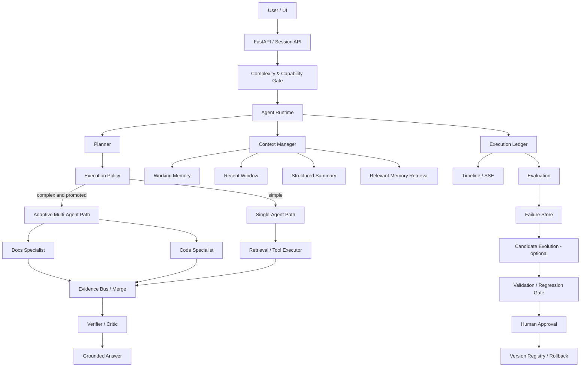

# 可评测 RAG Agent 项目主路线图 v5

> 项目：`wgqa/my_agent`  
> 路线图版本：**v5（Release 2.0：垂直实战、可观察长程 Agent 与评测驱动演进版）**  
> 编写日期：**2026-08-20**  
> v4 来源：`RAG_Agent_项目主路线图_v4_2026-08-13.md`  
> Release 1.0 远端基线：`75ae103f3a3483ef3213fbd5520c8b06bb0157ce`（`docs: accept and close Release 1.0`）  
> 当前仓库：`https://github.com/wgqa/my_agent`  
> 数据仓库：`https://github.com/wgqa/agent_data`  
> 本地项目：`D:\学习\rag实战项目\rag-knowledge-base`  
> Benchmark 工作目录：`D:\学习\rag实战项目\rag数据集\benchmark_work`

---

# 0. 这份 v5 的用途

这份文档不是愿望清单，也不是为了把 Multi-Agent、Memory、MCP、GraphRAG、自进化等热门名词塞进项目。

它承担四个职责：

1. **冻结 Release 1.0 的历史结论**，避免后续开发反复重开 Gate 1～5、重跑 sealed Holdout 或篡改旧实验叙事；
2. **指导 Release 2.0 的开发顺序**，把项目从“通用、可评测的 RAG/Tool Agent”推进成“真实软件研发场景中的 Engineering Agent”；
3. **规定每个新能力的进入条件、评测方法、验收标准和停止条件**，防止技术名词驱动开发；
4. **作为长期交接文件**：即使原审计者、执行 Agent 或当前聊天不可用，新接管者也能依靠 Git、冻结 Artifact 和本路线图继续推进。

v5 的总原则是：

> **Release 1.0 负责证明“系统是正确、可评测、可复现、可审计的”；Release 2.0 负责证明“系统在真实研发任务中有价值，而且新增复杂度值得”。**

---

# 1. v4 是否走偏：最终结论

## 1.1 没有走偏

v4 的核心目标是停止继续深挖低可见度的内部实验细节，快速补齐：

- Agentic RAG 主链；
- Query Decomposition；
- Adaptive Retrieval；
- Evidence Merge / Verification；
- Structured Tool Agent；
- 有界 Runtime；
- API/UI；
- CI、依赖锁定、Smoke、Demo；
- 可见 Trace 与工程收口。

这一战略已经成功把项目推进到 Release 1.0。

## 1.2 v4 没有 100% 按原始 DoD 完成，但属于合理收敛

v4 原计划中仍有几项没有完整落地：

- 真正持久化的 `Checkpoint / Resume / Cancel`；
- 结构化 SSE / 流式执行事件；
- 完整 Agent Timeline UI；
- Docker；
- 长期 Memory；
- Multi-Agent；
- 受控策略演进。

其中后三项本来就是“高级候选”，不是 Release 1.0 必做；前几项在 Release 1.0 中被有意收敛为安全 Trace、bounded runtime、capability/readiness、smoke 和 release demo。

因此：

> **v4 完成了“把系统做完整”的使命；v5 不继续修 v4，而是处理 Release 1.0 暴露出的新问题。**

---

# 2. Release 1.0 冻结基线：不可被 v5 重写

## 2.1 Git 基线

v5 编写时远端 `main`：

- HEAD：`75ae103f3a3483ef3213fbd5520c8b06bb0157ce`
- message：`docs: accept and close Release 1.0`
- 前一提交：`9e6c5f34e157f273b1827c50474d0974c037ae9f`（Release 1.0 candidate freeze）

任何新会话都必须重新检查远端，不得把上述 SHA 当作永远不变的 HEAD；它只表示 **Release 1.0 的 v5 起点**。

## 2.2 Gate 状态

| Gate | 冻结状态 | v5 处理 |
|---|---|---|
| Gate 1：基础 RAG 正确性 | CLOSED | 不重开；发现历史 Bug 走回归任务 |
| Gate 2：Retrieval Evaluation | CLOSED / FROZEN | 冻结数字不改写 |
| Gate 3：Agentic RAG | CLOSED / FROZEN | formal Holdout 不重跑 |
| Gate 4：Structured Tool Agent | CLOSED / FROZEN | baseline 不针对结果继续调参 |
| Gate 5：工程交付与产品能力收口 | CLOSED | Release 1.0 已交付 |

**v5 从 Gate 6 开始。**

## 2.3 Release 1.0 真实能力

### Basic RAG

- Dense / BM25 / Hybrid；
- Reranker；
- Context budget；
- grounded citation；
- 文档索引与查询。

### Agentic RAG

- 强类型 QueryPlan；
- Query Decomposition；
- deterministic Adaptive Router；
- BM25 / Hybrid / decomposed retrieval；
- Evidence Merge；
- Evidence Verification；
- grounded answer；
- safe structured trace。

### Structured Tool Agent

- strict structured decision；
- `knowledge_search`；
- `code_search`；
- `calculator`；
- Tool allowlist；
- bounded iterations / calls / errors；
- duplicate call stop；
- untrusted Tool Observation；
- safe trace。

### 工程交付

- FastAPI；
- Streamlit；
- `/health`；
- `/capabilities`；
- runtime readiness；
- graceful degradation；
- startup smoke；
- full-app smoke；
- GitHub Actions；
- `requirements.lock`；
- public corpus provenance；
- Release Demo harness。

## 2.4 Release 1.0 冻结指标

### Gate 2 — Retrieval

冻结 primary：Recursive + BM25 + `cl100k_content_v1`

| 指标 | 结果 |
|---|---:|
| Hit@5 | 0.98 |
| Recall@5 | 0.9533 |
| MRR | 0.7873 |
| nDCG@5 | 0.8206 |

### Gate 3 — Agentic RAG

Dev：

- retrieval obligation：`35/44 = 0.7955`
- answer obligation：`21/44 = 0.4773`
- answer pass：`8/20 = 0.40`
- citation valid：`16/16 = 1.0`

sealed Holdout：

- retrieval obligation：`18/21 = 0.8571`
- answer obligation：`8/21 = 0.3810`
- answer pass：`4/10 = 0.40`
- citation valid：`6/6 = 1.0`

这些数字证明：

> **检索找到证据 ≠ Generator 能完整覆盖答案 obligation。**

Release 2.0 必须继续面对这个 synthesis gap，不能只增加 Agent 数量。

### Gate 4 — Structured Tool Agent

Public Dev：

| 指标 | 结果 |
|---|---:|
| First action accuracy | `21/24 = 0.875` |
| Required tool coverage | `14/20 = 0.70` |
| Task completion | `20/24 = 0.8333` |
| Forbidden tool rate | `0/24` |
| Duplicate tool rate | `0/24` |
| Allowed sequence match | `1/4 = 0.25` |

已知能力债：

- multi-step Tool decision 稳定性弱；
- required tool coverage 仍不足；
- structured action parse 仍有失败；
- 更复杂长程任务尚未证明。

## 2.5 Release 1.0 已知限制

这些限制进入 v5 的候选输入，但不是全部都要修：

1. Agentic RAG / Tool Agent 主要仍是单轮 request contract；
2. 当前没有真正 streaming execution；
3. 当前没有长期 Conversation Memory；
4. 当前没有持久化 Run State / Checkpoint / Resume；
5. 当前没有公网 IAM、租户隔离；
6. 当前没有真正 Multi-Agent；
7. 当前没有受控 Self-Evolution；
8. 当前不是一个非常明确的垂直业务产品；
9. Generator robustness 与 retrieval-to-answer gap 仍明显；
10. Tool Agent multi-step sequence 能力仍弱。

---

# 3. v5 的第一性原则

## 3.1 Problem-driven，不是 Feature-driven

所有新能力必须先回答：

1. 它解决哪个真实用户任务？
2. Release 1.0 为什么解决不好？
3. 有什么 baseline？
4. 用什么指标证明改善？
5. 新增多少成本、延迟和复杂度？
6. 如果没有收益，是否允许删除或不晋级？

不能回答以上问题的能力，不进入主线。

## 3.2 Evaluation-first，但不要把评测本身工程化过头

对**架构策略、检索/Memory/Multi-Agent/进化等会增加系统复杂度的能力**，编码前先明确最小：

- baseline；
- 代表性 Case；
- 1～3 个核心 metric；
- 是否值得保留的判断标准。

普通 UI、Timeline、Demo 整合、文档和低风险工程功能，不要求先造一套正式 Benchmark；用验收 Case、smoke 和可见行为证明即可。

**复杂能力没有最小评测，不写；可见功能不要为了“Evaluation-first”先造一堆评测基础设施。**

## 3.3 Release 1.0 只读继承

- 不重新调 Gate 2 primary；
- 不重新跑 Gate 3 formal Holdout；
- 不针对 Gate 4 冻结 Dev 调参；
- 新实验创建新的 Release 2.0 Dataset / Dev / Validation / Holdout；
- 旧数字允许引用，不允许改写。

## 3.4 质量、成本、延迟三维一起评

以后不能只说：

> “Multi-Agent 准确率更高。”

必须同时报告：

- Task Success；
- Token；
- LLM Calls；
- Tool Calls；
- P50/P95 Latency；
- Estimated Cost；
- Failure Rate；
- Safety Regression。

## 3.5 不暴露私有 Chain-of-Thought

所有可视化均展示 **执行事实**，不是模型私有推理文本。

允许展示：

- node / action；
- route reason code；
- tool name；
- evidence count；
- latency；
- token usage；
- verification result；
- structured failure。

禁止展示：

- 私有 CoT；
- system prompt；
- 原始 provider output；
- API key；
- 本机敏感路径；
- secret；
- 未脱敏 Tool Observation。

## 3.6 不无限开发

Release 2.0 的目的不是建设创业公司级 Agent 平台。

当以下条件满足时必须准备冻结，而不是继续堆功能：

- 有清晰垂直业务故事；
- 有真实垂直 Benchmark；
- 有一条完整可视化 Agent Execution；
- 有一项真实 Context / Memory 增强，或另一项对真实任务明显有价值的高级能力；
- 有质量 / 成本 / 延迟的系统评测；
- 安全边界足以支撑当前只读 Demo，不存在明显越权或泄漏；
- 用户能够从头讲清主要模块、失败实验和 trade-off。

## 3.7 校招展示优先，禁止过度工程化

这是 v5 的**最高级治理规则之一**。本项目用于大厂校招主项目展示，不以真实生产上线、SLA、多租户、高并发或企业合规为目标。

所有任务先按下面顺序判断价值：

1. **用户能不能在 Demo 中直接看到？**
2. **面试时能不能形成一个值得追问的技术点？**
3. **有没有实验或 Case 能证明它不是摆设？**
4. **是否能在较短时间形成完整垂直切片？**
5. 最后才考虑生产级完备性。

默认优先级：

| 优先级 | 内容 | 原则 |
|---|---|---|
| P0 | 垂直真实任务、端到端功能、Agent Timeline、Context/Memory、核心评测、可演示失败处理 | **立即做** |
| P1 | 有明确 Case 支撑的 Multi-Agent、Critic、受控 Evolution、轻量恢复能力 | **有证据再做** |
| P2 | Docker、完整 Checkpoint/Resume、复杂幂等、完整安全攻防、OpenTelemetry、数据库/队列、IAM、多租户 | **默认不做或只做最小演示版** |
| P3 | Kafka/K8s/大规模分布式、企业级灰度平台、完整 RBAC、灾备、高可用 | **明确不做** |

审计者不得因为“生产上可能出问题”就反复阻塞主线。只有以下问题可以因为安全/可靠性阻塞：

- 会让当前 Demo 核心路径直接错误；
- 会泄漏密钥、私有数据或隐藏推理；
- 会导致无界循环、明显失控调用或越权工具执行；
- 会让实验数字失真；
- 会让 README/简历声称与真实实现不一致。

除此之外，极端边界、完整恢复、分布式可靠性、企业级安全和形式化完备性默认记为技术债。

**宁可今天完成一个能演示、能评测、能讲清楚的完整功能，也不要为了一个低概率边界再开三张 MICRO 任务卡。**

---

# 4. Release 2.0 产品定位

## 4.1 推荐定位

Release 2.0 不再使用过于宽泛的：

> “面向技术文档与代码的 RAG Agent”

建议升级为：

> **面向软件研发知识与代码维护场景的 Engineering Knowledge Agent：能够联合技术文档、源代码、配置与测试证据，完成代码/文档定位、配置追踪、故障诊断、变更影响分析与证据化回答，并通过可观察 Agent Runtime 控制工具、预算、上下文和失败。**

可使用对外短名：

- Engineering Knowledge Agent
- Code & Docs Reasoning Agent
- Software Engineering Copilot（避免声称完整 Coding Agent）

## 4.2 为什么这个垂直方向最合适

它最大程度复用 Release 1.0 已有资产：

- 技术文档 RAG；
- code_search；
- knowledge_search；
- Planner；
- decomposition；
- adaptive retrieval；
- evidence / citation；
- structured tool runtime；
- evaluation framework。

不需要为“垂直”突然换成医疗、金融等完全陌生数据和高风险场景。

## 4.3 目标用户

优先用户：

- 新接手代码库的开发者；
- 后端 / AI 应用工程师；
- 项目维护者；
- Tech Lead / Reviewer；
- 需要跨代码与文档定位问题的研发人员。

## 4.4 Release 2.0 核心真实任务

至少覆盖以下任务类型：

### A. Documentation QA

- 某能力按文档应该如何使用？
- 某配置默认值是什么？
- 某模块的约束是什么？

### B. Code Symbol / Implementation Lookup

- 某类 / 函数在哪里定义？
- 哪些模块调用它？
- 某配置在哪段代码中生效？

### C. Docs ↔ Code Consistency

- README 说限制为 X，代码是否一致？
- 文档说支持某能力，代码是否真的存在？

### D. Failure Localization

- 某错误最可能从哪条调用路径产生？
- 某异常对应哪些检查或 fallback？

### E. Change Impact Analysis

- 修改某类可能影响哪些调用方？
- 哪些测试覆盖这段逻辑？
- 哪些配置 / 文档也需要同步？

### F. Multi-source Reasoning

- 同时需要文档、代码、配置、测试证据的问题；
- 多模块 / 多文件证据才能回答的问题。

### G. Unanswerable / Refusal

- 当前仓库没有足够证据的问题；
- 用户要求系统推测外部事实的问题。

---

# 5. v5 总体架构候选



注意：

- Multi-Agent 是条件路径，不是默认路径；
- Evolution 是可选后期能力；
- Context Manager 是系统组件，不是为了凑“Memory”名词；
- Execution Ledger 是可观测、评测、失败分析、自进化共同的基础。

---

# 6. Release 2.0 Gate 总表

| Gate | 名称 | 类型 | 是否核心必做 |
|---|---|---|---|
| G6 | Vertical Productization & Benchmark | 产品 + 数据 + 评测 | **必须** |
| G7 | Observable Execution & Evaluation Ledger | Runtime + UI + Observability | **必须** |
| G8 | Context Engineering & Memory | 多轮 / 长上下文 | **建议必须** |
| G9 | Lightweight Reliability & Failure Demo | 轻量可靠性 / 失败演示 | **条件进入；非默认必做** |
| G10 | Adaptive Multi-Agent | 高级能力 | **条件进入** |
| G11 | Controlled Evolution | 高级能力 | **条件进入** |
| G12 | Release 2.0 Evaluation / Minimal Security / Freeze | 总评测 + 最小安全验证 + 展示 | **必须** |

**G10 / G11 不允许因为“路线图写了”就自动开始。**

---

# 7. V5-KICKOFF-00：Release 2.0 基线与交接治理

这是 v5 的第一张任务卡，优先级高于任何新功能。

## 7.1 目的

解决文档真相源漂移，确保以后换审计者 / Agent 仍能接管。

当前已知问题：`docs/HANDOFF.md` 仍停留在“Gate 4 CLOSED，NEXT=Gate 5”的历史接管点，不能继续作为 Release 2.0 的有效摘要。

## 7.2 允许修改

建议仅文档 / 元数据：

- `docs/roadmap.md`：替换为 v5 主路线；
- `docs/HANDOFF.md`：更新到 Release 1.0 CLOSED / Release 2.0 NEXT；
- `docs/status.md`：登记 v5 kickoff；
- `docs/archive/`：归档旧 v4；
- 可选新增 `docs/releases/release1_baseline.json` 或等价只读基线说明。

## 7.3 release1 baseline 建议字段

```json
{
  "schema_version": "release_baseline_v1",
  "release": "1.0",
  "status": "closed_frozen",
  "source_commit": "75ae103f3a3483ef3213fbd5520c8b06bb0157ce",
  "gate2_freeze": "docs/experiments/gate2_freeze.json",
  "gate3_system_freeze": "docs/experiments/gate3_system_freeze.json",
  "gate3_holdout_final": "docs/experiments/gate3_holdout_final.json",
  "gate4_freeze": "docs/experiments/gate4_freeze.json",
  "rules": {
    "rerun_gate3_formal_holdout": false,
    "rewrite_release1_metrics": false
  }
}
```

文件名和 schema 可由执行时根据仓库现状调整；不得伪造不存在的 ID。

## 7.4 验收

- Git 远端事实已核对；
- v4 进入 archive，不与 v5 并行作为长期路线；
- HANDOFF 不再指向 Gate 5 NEXT；
- Release 1.0 冻结规则明确；
- 不修改任何冻结实验数字；
- 文档任务以链接/路径/状态一致性检查为主；**不为了纯文档改动机械跑全量 pytest**。

---

# 8. G6 — Vertical Productization & Benchmark

G6 是 Release 2.0 最重要的 Gate。

**没有 G6，不允许先做 Multi-Agent / Memory / Self-Evolution。**

## 8.1 G6-DESIGN-01：垂直产品契约

### 目标

冻结 Release 2.0 的：

- 用户；
- 场景；
- 输入；
- 输出；
- source types；
- 工具边界；
- 不做范围。

### 必须回答

1. 用户为什么不用普通代码搜索？
2. 为什么普通 RAG 不够？
3. 哪些任务必须跨 docs + code？
4. 哪些任务需要 Agent tool loop？
5. 哪些任务必须拒答？

### 输出

建议：

- `docs/design/release2_vertical_product_contract.md`
- ADR：`Engineering Knowledge Agent` 定位
- study note

### 退出条件

至少定义 6 类真实任务，每类有正常例和失败例。

---

## 8.2 G6-DATA-02：公开 Repo Snapshot 选择与冻结

### 原则

不要直接用实时 GitHub HEAD 做 benchmark。

每个 corpus source 必须绑定：

- repo URL；
- commit SHA；
- language / framework；
- file allowlist；
- file count；
- file SHA manifest；
- license / public usage note。

### Repo 选择建议

第一版优先：

- 文档充足；
- 代码结构清晰；
- 有配置和测试；
- 文件规模适中；
- 当前 `code_search` 能处理；
- 不要求为了 benchmark 先造新的语言 parser。

**不要为了展示 Java/多语言，强迫 G6 同时重写 Code Search。**

### Split 推荐

推荐使用 repository-level 或 module-level 隔离，避免同一问题模板在 train/dev/holdout 中泄漏。

建议目标：

- 多个固定 repo snapshot；
- Dev / Validation 公开；
- Release 2.0 Holdout sealed；
- 实现 Agent 不读取 sealed case 与 gold。

数量不追求越大越好，但必须足以覆盖主要任务类型并支持逐 Case 分析。

---

## 8.3 G6-DATA-03：Vertical Case Schema

建议 Case 至少包含：

```text
case_id
repo_snapshot_id
query
task_type
complexity
required_source_types
relevant_files
relevant_symbols
gold_evidence
answer_obligations
allowed_tools
forbidden_claims
requires_cross_source
requires_multi_step
unanswerable
notes
```

### task_type 推荐

- `doc_fact`
- `code_symbol`
- `config_trace`
- `doc_code_consistency`
- `failure_localization`
- `change_impact`
- `multi_source_reasoning`
- `unanswerable`

### complexity 推荐

- L1：单来源、单步；
- L2：多证据但单工具链；
- L3：跨 docs/code、多步；
- L4：需要冲突处理、长上下文或多个工具。

**复杂度标签必须用于后续判断 Multi-Agent 是否有必要。**

---

## 8.4 G6-DATA-04：Gold 与泄漏控制

### Gold 原则

- 结论必须能映射到冻结 repo snapshot；
- 不以 LLM 自己生成的答案直接当 Gold；
- Evidence locator 最好包含 path + symbol/line-range/section；
- multi-source case 必须至少两个独立证据源；
- unanswerable 要说明为什么当前 corpus 不足。

### Holdout 原则

- 实现 Agent 不读；
- Prompt / router / memory 策略不针对 Holdout 调参；
- 日常 evolution 不碰正式 Holdout；
- 最终 Release 2.0 只在冻结候选后执行授权评测。

---

## 8.5 G6-EVAL-05：Release 1.0 Vertical Baseline

在新增高级能力前，必须先让 **Release 1.0** 跑新的垂直 Dev Benchmark。

这是关键：

> 不先测 R1，就不知道 R2 新能力到底解决了什么。

### Baseline 至少记录

- task success；
- answer obligation coverage；
- evidence/source coverage；
- citation validity；
- tool choice；
- tool sequence；
- unanswerable/refusal accuracy；
- input/output tokens；
- LLM calls；
- tool calls；
- latency P50/P95；
- failure taxonomy。

### 输出

- per-case JSONL；
- metrics JSON；
- failure analysis；
- baseline manifest；
- study note。

### G6 退出条件

必须能回答：

> Release 1.0 在真实 Engineering tasks 上最主要的三类失败是什么？

如果答不出来，G6 未完成。

---

# 9. Evaluation 2.0：贯穿 G6～G12

Evaluation 不再是最后补的 Gate，而是每个 Gate 的输入和出口。

## 9.1 核心指标层

### Quality

- Task Success Rate；
- Answer Obligation Coverage；
- Citation / Evidence Validity；
- Required Source Coverage；
- Refusal Accuracy；
- Multi-step Completion；
- Failure Recovery Rate。

### Cost

- Input Tokens；
- Output Tokens；
- Total Tokens；
- LLM Calls；
- Tool Calls；
- Estimated Cost。

### Latency

- End-to-End P50/P95；
- Planner latency；
- Retrieval latency；
- Tool latency；
- Critic / specialist overhead。

### Safety

- Forbidden Action Rate；
- Prompt Injection Success Rate；
- Secret Leakage Rate；
- Unauthorized Tool Attempt；
- unsafe trace leakage。

## 9.2 逐 Case 永远保留

不得只有平均分。

每个正式实验必须能回到：

```text
case
→ plan
→ route
→ context
→ tool/retrieval
→ evidence
→ answer
→ metric
→ failure reason
```

## 9.3 配对比较

对于同一 Case 的 A/B 系统比较，优先使用 paired analysis。

建议：

- paired bootstrap 95% CI；
- 对 binary task success 可选 McNemar 作为补充；
- 样本小则诚实报告宽 CI，不强行声称显著。

### 不允许

```text
A=76%
B=79%
所以 B 显著更好
```

除非统计和样本真的支持。

## 9.4 Promotion 不是只看质量

推荐候选晋级表：

| 维度 | 要求 |
|---|---|
| Quality | 目标子集有实际改善，或整体非退化 |
| Cost | 增长在预注册可接受范围 |
| Latency | 不出现无法解释的失控 |
| Safety | 不允许退化 |
| Stability | error / parse failure 不恶化 |
| Reproducibility | run identity 完整 |

阈值在每个实验前预注册，不在看到结果后临时修改。

---

# 10. G7 — Observable Execution & Evaluation Ledger

G7 解决“Agent 仍有黑盒感”的问题。

## 10.1 目标

建立统一 Execution Event / Ledger，让：

- UI 可视化；
- Evaluation 可统计；
- Failure analysis 可回放；
- Durable Runtime 可 checkpoint；
- Evolution 可消费失败 Trace。

**G7 是多个后续能力的基础，不只是前端美化。**

---

## 10.2 G7-RUNTIME-01：Execution Event Schema

建议事件：

```text
run_started
planning_started
planning_completed
route_selected
context_prepared
retrieval_started
retrieval_completed
tool_call_started
tool_call_completed
evidence_merged
verification_completed
critic_started
critic_completed
answer_started
answer_completed
run_refused
run_failed
run_cancelled
```

每个事件至少：

```text
run_id
event_id
step_id
event_type
timestamp
status
duration_ms
safe_summary
metrics
```

### 严格安全边界

不得放：

- CoT；
- raw prompt；
- provider raw output；
- secret；
- 完整不可信文档正文；
- 本机绝对敏感路径。

---

## 10.3 G7-RUNTIME-02：Execution Ledger

第一版不需要 Redis / Kafka。

建议最小持久层：

- SQLite 或当前项目可控本地存储；
- append-oriented events；
- run summary；
- query by run_id；
- retention policy。

### Run Summary

建议包含：

```text
run_id
mode
status
started_at
finished_at
planner_calls
llm_calls
tool_calls
retrieval_calls
input_tokens
output_tokens
latency_ms
failure_reason
policy_versions
```

---

## 10.4 G7-API-03：Streaming Events

建议使用 SSE 作为第一版。

原因：

- Agent 主要是 server → client 单向事件；
- 比 WebSocket 简单；
- 适合 Timeline；
- 不需要为了名词引入复杂实时架构。

需要明确：

- heartbeat；
- client disconnect；
- final event；
- failed event；
- safe serialization。

如果 SSE 与当前框架集成成本明显高，可先提供 polling `GET /runs/{run_id}/events`，但 Timeline 数据模型必须先完成。

---

## 10.5 G7-UI-04：Agent Timeline

UI 必须能展示：

```text
Planning       ✓  120ms
Routing        ✓  hybrid
Retrieval      ✓  5 evidences
Code Search    ✓  3 hits
Evidence Merge ✓  6 → 4
Verification   ✓  complete
Answer         ✓  1.8s
```

展开可显示：

- reason code；
- tool args 的安全摘要；
- source type；
- evidence count；
- token；
- budget；
- fallback / retry；
- failure reason。

### 禁止

UI 不显示“Thought / Reasoning / Internal Chain-of-Thought”。

---

## 10.6 G7-EVAL-05：Observability Overhead

必须测：

- event serialization overhead；
- ledger write overhead；
- streaming / polling overhead；
- run latency change；
- event completeness。

### 退出条件

给任意一个 run_id，能够完整回答：

> “系统执行了什么、花了多少、在哪一步失败、使用了什么版本”，而不需要打开日志猜测。

---

# 11. G8 — Context Engineering & Memory

G8 的目标不是“实现四种 Memory 名词”，而是解决有限 Context Window 中的信息选择问题。

## 11.1 Context Manager 逻辑组成

```text
Context Budget
├── System Constraints
├── Current Query
├── Recent Conversation Window
├── Structured Conversation Summary
├── Relevant Historical Memory
├── Current Retrieval Evidence
├── Tool Observations
└── Reserved Answer Budget
```

## 11.2 G8-DESIGN-01：Context Budget Contract

必须定义：

- total input budget；
- reserved output budget；
- system fixed budget；
- evidence minimum / maximum；
- conversation budget；
- memory budget；
- overflow policy；
- deterministic truncation priority。

不能发生：

> “有多少 history 就全部塞多少。”

---

## 11.3 G8-MEM-02：Memory 类型

第一版只做真正有用的三类：

### Working Memory

当前任务：

- user goal；
- active constraints；
- completed steps；
- pending subtask。

### Conversation Summary

历史多轮对话的结构化压缩。

### Retrieved Long-term Memory

只召回与当前 query 有关的历史事实或用户确认约束。

**Episodic / Procedural 等名词只有出现真实需求时再加入。**

---

## 11.4 Memory 数据不能盲目写入

建议写入规则：

- 用户明确确认的长期约束：可写；
- 系统推测：不可直接写成事实；
- Tool Observation：默认不进入长期 Memory；
- 过期事实：标记 superseded；
- 敏感数据：按项目本地安全策略过滤。

建议字段：

```text
memory_id
memory_type
content_summary
source_turn/source_run
created_at
updated_at
status
supersedes/superseded_by
importance
retrieval_tags
```

---

## 11.5 G8-EVAL-03：Context Strategy Ablation

至少比较：

| Arm | Strategy |
|---|---|
| A | Full History |
| B | Fixed Sliding Window |
| C | Summary Only |
| D | Window + Summary |
| E | Window + Summary + Relevant Memory Retrieval |

### 测试场景

- long-term constraint recall；
- user correction；
- stale memory；
- conflicting history；
- old fact retrieval；
- irrelevant history noise；
- context overflow。

### 典型 stale-memory Case

```text
Turn 2: 部署必须 Docker
Turn 15: Docker 要求取消
Turn 30: 当前部署约束是什么？
```

系统如果回答“必须 Docker”，则 Memory 失败。

### 指标

- Constraint Recall；
- Stale Memory Rate；
- Contradiction Rate；
- Task Success；
- Token Reduction；
- Latency；
- Retrieval Precision of Memory。

### Promotion

默认不以“更复杂”取胜。

如果 `Window + Summary` 已经足够，则不必上线更复杂长期向量 Memory。

---

# 12. G9 — Lightweight Reliability & Failure Demo（条件进入）

G9 **不是 Release 2.0 默认必做 Gate**。只有当 G6/G7/G8 的真实 Demo 已经出现“任务时间较长、中途失败、取消/恢复明显影响展示”的证据时才进入。

校招版本优先做能够展示工程判断的最小可靠性能力，而不是建设通用 Durable Workflow Engine。

推荐先后顺序：

1. provider/tool timeout；
2. structured failure；
3. 用户可见 cancel（如果 streaming/长任务确实需要）；
4. 仅在 Demo 明显需要时再做最小 checkpoint/resume。

如果前 1～3 项已经足以支撑完整 Demo，允许直接关闭 G9，不做持久 checkpoint/resume。

## 12.1 G9-STATE-01：最小 Run State（可选）

若进入 G9，建议最小状态：

```text
created
queued
running
waiting_approval
completed
refused
failed
cancelled
```

不得用互相冲突的 bool 字段表达状态。

状态迁移必须有测试。

---

## 12.2 G9-CP-02：Checkpoint（可选增强，不默认实现）

只有真实长任务 Demo 需要恢复时才实现。第一版 checkpoint 只发生在安全 step boundary：

- planning 完成；
- retrieval/tool 完成；
- evidence merge 完成；
- verification 完成。

Checkpoint 至少保存：

```text
run_id
state
next_step
budget_consumed
safe_intermediate_refs
policy_version
context_version
event_cursor
```

不保存：

- API key；
- private CoT；
- raw secret；
- 不必要的完整 provider output。

---

## 12.3 G9-RESUME-03：Resume（与 Checkpoint 同进同退）

未进入 Checkpoint 时不要单独实现 Resume。若实现，第一版只保证：

- read-only tools；
- deterministic step boundaries；
- 不重复已完成 Tool Call；
- budget 继续累计；
- event stream 连续。

**不要在还没有幂等设计时支持任意 write-tool resume。**

---

## 12.4 G9-CANCEL-04：Cancel / Timeout

**最低优先只要求 timeout 和结构化错误。** 如果 G7 已有 streaming 且任务持续时间足以让取消有演示价值，再支持：

- client cancellation request；
- cooperative cancel check；
- provider timeout；
- tool timeout；
- cancelled terminal state。

不保证强制杀死所有外部调用，但状态必须可解释。

---

## 12.5 G9-IDEMP-05：Idempotency（只做到当前只读 Tool 所需）

不要建设通用分布式幂等框架。若 checkpoint/resume 被采用，只需明确：

- request idempotency key；
- run_id 唯一性；
- tool_call_id；
- duplicate tool invocation detection；
- resume 不重复副作用。

当前 read-only tool 可以先做最小版本。

---

## 12.6 G9-FAIL-06：最小 Failure Demo

不建立庞大故障矩阵。优先模拟 3～5 个面试最值得展示的失败：

- Planner timeout；
- Planner malformed JSON；
- retriever unavailable；
- empty retrieval；
- Tool timeout；
- Tool error；
- provider 500；
- context budget overflow；
- 可选：client cancel（若实现）；
- 可选：resume after interruption（仅在实现 checkpoint/resume 后）。

每种失败明确：

```text
retry / no retry
fallback / no fallback
refuse / fail
checkpoint behavior
user-visible error
```

### 退出条件

系统至少能清晰展示“成功、超时/Tool 失败、预算或 Context 失败”三类行为；**不要求为校招 Demo 建成生产级恢复引擎**。

---

# 13. Human-in-the-loop：条件能力，不独立强行立 Gate

当前 Release 1.0 Tool 全部只读，所以 Human Approval 不是当前 P0。

只有新增高风险 write actions 时进入：

- modify file；
- create PR；
- update issue；
- execute mutable command；
- deploy；
- destructive action。

## 13.1 权限原则

```text
Read Tool     → 可自动
Low-risk Tool → policy 决定
Write Tool    → 默认 Approval Required
Destructive   → 默认禁止或双确认
```

## 13.2 模型 / Runtime / 人类职责

> 模型拥有建议权；Runtime 拥有执行权；人类拥有高风险批准权。

这条原则进入任何未来 write-tool 设计。

---

# 14. G10 — Adaptive Multi-Agent（条件进入）

## 14.1 进入 Gate

以下条件全部满足才允许正式立项：

1. G6 Vertical Benchmark 已稳定；
2. Single Agent baseline 已存在；
3. 至少有一组复杂 L3/L4 任务存在稳定失败；
4. Failure analysis 证明问题来自角色 / context / source specialization，而不仅仅是检索没命中；
5. G7 Execution Ledger 已能记录每个 Specialist 成本；
6. 已预注册 Single vs Multi 的评测方案。

如果这些条件不满足：**不做 Multi-Agent。**

---

## 14.2 推荐最小角色

### Supervisor / Planner

- 决定是否进入 multi-agent；
- 分配 source / budget；
- 不直接拥有全部工具。

### Docs Specialist

工具：

- knowledge_search；
- document context。

### Code Specialist

工具：

- code_search；
- symbol / reference lookup（如果后续实现）。

### Critic / Verifier

- 不生成全新无证据答案；
- 检查 source conflict；
- 检查 obligation coverage；
- 检查引用支持。

第一版不要再加 Writer / Arbiter / Manager 等角色。

---

## 14.3 Agent 必须真正隔离

Multi-Agent 不是多个 Prompt 名字。

每个角色至少在以下一项上有真实差异：

- tool permission；
- context source；
- budget；
- task contract；
- output schema。

最好多项同时存在。

---

## 14.4 G10-EVAL：必须三 Arm

至少：

| Arm | 系统 |
|---|---|
| A | Single Agent |
| B | Single Agent + Critic |
| C | Adaptive Multi-Agent |

报告：

- overall task success；
- L1/L2/L3/L4 success；
- cross-source subset；
- token；
- latency；
- calls；
- error；
- safety。

### 推荐决策规则

Multi-Agent 只在复杂子集有明确收益时保留。

如果：

- 简单任务收益很小；
- latency/token 大幅增加；

则最终 Policy 应是：

> **simple → Single Agent；complex → Multi-Agent。**

如果复杂子集也没有可信收益，G10 可以以“负结果 / 不晋级”关闭。

这仍然是高价值项目结论。

---

# 15. G11 — Controlled Evolution（条件进入）

Self-Evolution 不是 Release 2.0 必做。

## 15.1 进入 Gate

需要：

- G7 Execution Ledger 稳定；
- 至少形成可分类失败数据；
- 候选策略已经版本化；
- Dev / Validation / Release Holdout 已隔离；
- 有 rollback 语义。

如果失败样本太少，就不做。

---

## 15.2 v1 允许“进化”的对象

只允许：

- Planner Prompt；
- Router Policy；
- Tool Decision Prompt；
- Verifier Policy；
- Context Policy 参数。

禁止：

- 自动修改 Python 核心源码；
- 自动 commit / push；
- 自动部署；
- 自动修改安全 allowlist；
- 自动修改 sealed Holdout。

---

## 15.3 Evolution Loop

```text
Observe Failure
→ Classify
→ Build Candidate
→ Offline Replay
→ Dev Evaluate
→ Validation Regression Gate
→ Human Review
→ Candidate Version
→ Shadow / Limited Activation
→ Promote or Reject
→ Rollback Available
```

## 15.4 Failure Store

建议：

```text
failure_id
run_id
case_id
failure_type
component
severity
expected
observed
candidate_target
review_status
```

推荐 failure_type：

- planning_error；
- unnecessary_decomposition；
- missed_decomposition；
- retrieval_miss；
- source_selection_error；
- tool_selection_error；
- tool_sequence_error；
- synthesis_gap；
- citation_error；
- stale_memory；
- context_overflow；
- safety_violation；
- structured_parse_failure。

---

## 15.5 Version Registry

至少：

```text
version_id
component
parent_version
artifact_sha
source_commit
created_at
candidate_reason
dev_metrics
validation_metrics
promotion_status
approved_by
rollback_target
```

## 15.6 Holdout 纪律

正式 Release Holdout 不参与日常 candidate selection。

日常：

```text
Failure/Train
→ Dev
→ Validation
```

只有 Release Candidate 冻结后，才授权 formal Holdout。

---

# 16. Minimal Agent Security Validation：只做校招可信边界

当前 Runtime 已有 allowlist、budget、untrusted observation、safe trace，这对单用户、只读 Tool 的校招 Demo 已经是较好的安全基础。

Release 2.0 **不建设生产级 Agent Security 平台**。这里只做一个规模受控、可演示的 adversarial subset，证明系统不会把检索文本、代码注释或 Tool Observation 轻易提升为系统控制指令。

## 16.1 Threat Categories

优先选择 3～5 类最相关场景，不要求全部覆盖：

- retrieved document prompt injection；
- source code comment injection；
- Tool Observation injection；
- user attempt to override budget；
- unregistered tool request；
- request secret/system prompt；
- malicious memory instruction；
- trace data exfiltration。

## 16.2 Security Metrics

最小报告即可：

- Attack Success / Block Rate；
- Forbidden Tool Rate；
- Secret / Trace Leakage 是否为 0；
- 典型失败 Case。

不为了校招版本构造大规模红队平台或复杂攻击分类体系。

## 16.3 原则

攻击 case 不能只测试一句：

> “Ignore previous instructions.”

应该把攻击内容放进：

- README；
- 文档段落；
- 代码注释；
- Tool result；
- Memory。

测试系统是否把“数据”错误提升为“控制指令”。

---

# 17. G12 — Release 2.0 总评测与 Freeze

G12 是最终强制 Gate。

即使 G10/G11 被跳过，也必须完成 G12。

## 17.1 Release 2.0 Candidate Freeze

冻结：

- source commit；
- corpus snapshots；
- dataset IDs；
- prompt versions；
- router/context policy versions；
- model/provider；
- runtime limits；
- tool registry；
- evaluation schema。

冻结后再跑 formal Holdout。

---

## 17.2 Formal Evaluation 总表

必须覆盖：

### Vertical Task Quality

- overall task success；
- per task type；
- per complexity；
- cross-source success；
- unanswerable/refusal。

### Agent Execution

- planning；
- route；
- tool sequence；
- recovery；
- resume/cancel（如果实现）。

### Context

- long-context success；
- stale memory；
- token reduction；
- contradiction。

### Safety

- prompt injection；
- forbidden action；
- leakage。

### Cost / Latency

- token；
- cost；
- P50/P95；
- calls。

### Statistics

- paired deltas；
- confidence interval；
- failure count。

---

## 17.3 Release 1.0 vs Release 2.0

必须有一张对照表，不只写 R2 的绝对分数。

例如：

| Metric | R1 Baseline | R2 | Delta | Cost Delta |
|---|---:|---:|---:|---:|
| Vertical Task Success | ... | ... | ... | ... |
| L3/L4 Success | ... | ... | ... | ... |
| Refusal Accuracy | ... | ... | ... | ... |
| Token / Task | ... | ... | ... | ... |
| P95 Latency | ... | ... | ... | ... |
| Security ASR | ... | ... | ... | ... |

没有数据前不要填漂亮数字。

---

# 18. Release 2.0 Demo 设计

至少 3 个，推荐 4 个。

## Demo A：简单精准任务

问题：单文档或单代码定位。

展示：

- Planner；
- Route；
- retrieval/code_search；
- evidence；
- answer/citation；
- timeline。

目的：证明简单问题不需要过度 Agent 化。

## Demo B：跨 Docs + Code

问题：

> 文档声称某能力 / 限制，代码是否一致？

展示：

- decomposition；
- knowledge_search；
- code_search；
- evidence merge；
- conflict handling；
- verifier；
- grounded conclusion。

这是 Release 2.0 主 Demo。

## Demo C：长上下文 / Memory

多轮对话中：

- 用户给出约束；
- 后续更新约束；
- 长时间后追问；
- Timeline 展示 context strategy；
- 系统避免 stale memory。

## Demo D：失败 / 安全 / 恢复

可选组合：

- Tool timeout；
- prompt injection；
- cancel/resume；
- insufficient evidence refusal。

展示：

> Agent 的工程价值不仅是“答对”，还包括“安全地失败”。

---

# 19. README / 简历叙事要求

## 19.1 README 首页顺序

建议：

1. 一句话业务价值；
2. Demo GIF / 截图；
3. Engineering Agent 场景；
4. Architecture；
5. Observable Timeline；
6. Vertical Benchmark；
7. R1 vs R2 对照；
8. Context / Runtime / Multi-Agent（如果晋级）；
9. Safety；
10. Quick Start；
11. Known Limitations；
12. Evaluation / Artifact 链接；
13. Study Notes。

不要让首页首先出现几十个 Gate task ID。

## 19.2 简历叙事候选（只能在完成后写）

最终希望接近：

> 构建面向软件研发知识与代码维护场景的可评测 Engineering Agent，联合文档、代码、配置和测试证据完成跨源问题分析；设计可观察 Agent Runtime，以结构化 Execution Ledger 记录 Planner、Retriever、Tool、Verifier 的事件、预算、Token 和延迟，并支持受控 Context Management、失败恢复与安全边界。建立 repo snapshot 级 Dev/Validation/Holdout 与逐 Case 评测，对 Single-Agent、Context 策略及可选 Multi-Agent 做质量/成本/延迟消融，以冻结证据决定策略晋级。

如果 Multi-Agent 没有晋级，就不要写“实现 Multi-Agent 提升 X%”。

---

# 20. 高级候选能力决策表

| 候选 | 默认状态 | 进入条件 |
|---|---|---|
| Multi-Agent | 条件 | G6 complex failures 支持 |
| Self-Evolution | 条件 | 足够 Failure traces + registry |
| MCP | 默认不做 | 有真实外部工具生态需要 |
| A2A | 默认不做 | 真正跨独立 Agent 服务 |
| GraphRAG | 默认不做 | 关系型失败证据稳定存在 |
| Java Control Plane | 可选 | 目标岗位明确需要 + Python 主链已冻结 |
| Docker | 可选工程收口 | 部署 / Demo 真的需要 |
| Redis | 默认不做 | SQLite/内存无法满足真实并发/恢复 |
| Kafka | 默认不做 | 出现真实异步事件吞吐需求 |
| PostgreSQL | 默认不做 | 本地单用户存储真实成为瓶颈 |
| Kubernetes | 不做 | 校招主项目无实际必要 |
| Fine-tuning | 默认不做 | Prompt/Policy 无法解决且有训练数据 |
| Arbitrary Shell Tool | 默认禁止 | 高风险，除非沙箱+审批+专门安全评测 |

---

# 21. GraphRAG 决策 Gate

只有全部满足才讨论实现：

1. Vertical Benchmark 有明确关系型 / 多跳子集；
2. Decomposition + BM25/Hybrid 在该子集稳定失败；
3. 失败原因确实是关系表达，而不是 query / evidence / generator；
4. 可构建确定性 graph source（AST / call graph / config relation）；
5. Graph 结果能映射回原始可引用证据；
6. 有 Graph vs non-Graph 对照；
7. 成本合理。

否则写 Future Work。

---

# 22. MCP 决策 Gate

MCP 是协议能力，不是 Agent 智能本身。

只有存在真实需求时做：

- 需要接多个外部工具服务；
- Tool Registry 已成为重复适配负担；
- 有 MCP Server 能真正提升演示 / 可扩展性。

如果只是把现有 `calculator` 包一层 MCP，不作为核心亮点。

---

# 23. Java Control Plane 决策 Gate

如果最终投递方向偏“Java 后端 + AI 应用”，可以做薄控制面，但不重写 AI 核心。

Java 可负责：

- session / task API；
- run state；
- idempotency；
- rate limit；
- approval；
- SSE proxy；
- trace query；
- user-facing gateway。

Python 继续负责：

- retrieval；
- planning；
- tool runtime；
- context；
- evaluation。

进入前必须证明：

> 这是为了展示真实服务边界，而不是为了让技术栈列表多一行 Java。

---

# 24. 技术债优先级

## P0：阻塞 Release 2.0 可信度

- Release 1.0 / v5 truth-source 不一致；
- 新 Holdout 泄漏；
- frozen artifact 被覆盖；
- 安全边界失效；
- 无上限循环 / retry；
- cost / token 统计明显错误；
- execution events 泄漏 secret / CoT；
- 测试失败；
- README 夸大未实现能力。

## P1：影响垂直产品 / Demo

- Vertical corpus identity；
- code/docs source locator；
- timeline；
- multi-turn context；
- structured failure；
- Generator synthesis gap；
- Tool multi-step instability。

## P2：可延后

- 完整 IAM；
- multi-tenant；
- distributed queue；
- large-scale load testing；
- cloud deployment；
- many vector DB adapters；
- perfect observability stack；
- full OpenTelemetry；
- GraphRAG；
- A2A。

---

# 25. 审计规则 v5

## 25.1 阻塞问题

以下必须返工：

- 核心行为与任务契约不符；
- 数据泄漏；
- secret 泄漏；
- frozen result 被改写；
- formal Holdout 被未经授权重复执行；
- Runtime 可能无限循环；
- Tool 越权；
- context/memory 把不可信内容提升为系统指令；
- metric 公式错；
- cost / token / latency 统计假数据；
- baseline 与 candidate 不可比较；
- 测试失败；
- README / 简历声称未实现能力。

## 25.2 默认技术债 / 不得阻塞主线

- 生产级高可用、灾备、分布式一致性；
- 完整 IAM / RBAC / 多租户；
- 全面 Checkpoint/Resume 与跨进程恢复；
- 完整安全红队与企业级审计；
- 极端输入完美防御；
- 不影响实验结论的格式问题；
- 过早分布式化；
- 非核心部署美化；
- 没有真实需求的第三方协议适配；
- 没有数据支持的性能优化；
- 为了“设计完整”而增加的抽象层、状态、schema、provenance 字段；
- 不影响 Demo、实验结论和面试表达的低概率边界。

## 25.3 复审次数与任务粒度

正常任务：

- 一次实现；
- 一次审计；
- 阻塞问题才发 R1；
- 同一任务不进行无限 MICRO 修复；
- **优先一张任务卡完成一个可见垂直切片**（实现 + 必要测试 + Demo/学习说明），不要把一个功能拆成设计/Schema/实现/文档/微修五六张卡；
- 非阻塞问题直接登记 technical debt 后继续。

---

# 26. 执行 Agent 规则

每张任务卡默认只需要包含：

1. 任务 ID 与可见目标；
2. 范围（允许/禁止修改）；
3. 核心行为与验收 Case；
4. 必要测试/实验；
5. 需要时的学习说明；
6. commit 后停止。

只有正式 Benchmark / Freeze / 高风险 Tool 任务，才补充复杂 Artifact、provenance 或额外审计字段。

执行 Agent 必须：

- 先 `git fetch`；
- 检查 HEAD / origin/main；
- 检查 tracked working tree；
- 不删 untracked benchmark artifact；
- 不自行 reset / rebase / amend；
- 不碰 sealed Holdout；
- 不自行调用真实模型，除非任务卡明确是实验任务；
- 不自行开始下一 Gate；
- 提交后停止并报告；
- 用户可能手动 push，因此下一个会话重新核对远端。

---

# 27. 测试策略 v5

## 每个普通任务

- unit test；
- targeted integration；
- fake provider；
- no real network by default。

## 每个 Gate closure

- 核心代码 Gate 运行全量 pytest；纯文档/展示性 Gate 不机械要求；
- API smoke（相关时）；
- UI/App smoke（相关时）；
- artifact validation；
- documentation consistency。

## 正式模型调用

仅用于：

- baseline；
- controlled experiment；
- release demo；
- formal holdout。

模型调用不因测试失败自动无限重跑。

---

# 28. 学习文档要求

每个重要 Gate 至少一篇 study note，必须能脱离当前聊天阅读。

最低结构：

1. 问题是什么；
2. 最简单方案是什么；
3. 为什么不够；
4. 数据结构；
5. 调用流程；
6. 正常 Case；
7. 失败 Case；
8. 测试；
9. 评测指标；
10. 实验结果；
11. trade-off；
12. 面试追问；
13. 已知限制。

Release 2.0 最后形成新的学习顺序：

1. Release 1.0 架构复盘；
2. Vertical Benchmark；
3. Observable Runtime；
4. Context Engineering；
5. Memory；
6. Durable Runtime；
7. Failure Engineering；
8. Security；
9. Adaptive Multi-Agent（若实现）；
10. Controlled Evolution（若实现）；
11. Release 2.0 实验与简历表达。

---

# 29. Release 2.0 Definition of Done

## 29.1 必须完成

### 产品

- Engineering Agent 定位冻结；
- 真实 repo snapshot corpus；
- Vertical Dev/Validation/Holdout；
- 至少 6 类研发任务；
- 三个以上完整 Demo。

### Runtime

- 结构化 Execution Event；
- Run ID；
- Execution Ledger；
- Timeline；
- token / call / latency 统计；
- structured failure。

### Context

- multi-turn contract；
- context budget；
- 至少 Sliding Window 与 Summary baseline；
- 至少一个更强策略经过消融；
- stale memory / correction 测试。

### Reliability

- provider / Tool timeout 有结构化失败；
- 至少 3 个有展示价值的失败 Case；
- cancellation、checkpoint/resume **只有在真实 Demo 需要时才实现**，否则明确记为非生产范围。

### Evaluation

- Release 1.0 vertical baseline；
- Release 2.0 candidate；
- per-case results；
- quality / cost / latency；
- paired comparison；
- 最小 adversarial security validation；
- formal Holdout；
- frozen final result。

### Engineering

- CI；
- lockfile；
- smoke；
- updated README；
- architecture diagram；
- demo；
- study notes；
- handoff；
- known limitations。

## 29.2 条件完成

以下不要求全部做：

- Multi-Agent；
- Self-Evolution；
- MCP；
- Java Control Plane；
- GraphRAG；
- Docker；
- OpenTelemetry；
- write tools。

这些能力只有通过各自 Gate 才能进入 Release 2.0 headline。

---

# 30. Release 2.0 Stop Rules

满足以下任一情况，应停止继续扩展某能力：

## Multi-Agent Stop

- complex subset 没有稳定收益；
- cost/latency 明显不值；
- 单 Agent + Critic 已解决主要问题。

## Memory Stop

- Window + Summary 已达到需求；
- retrieval memory 主要增加 stale/irrelevant recall；
- token 节省没有转化为任务收益。

## Evolution Stop

- failure 样本不足；
- candidate 经常 regression；
-人工调优成本低于自动 candidate loop；
- formal validation 无稳定收益。

## GraphRAG Stop

- 失败不是关系型；
- decomposition 已解决；
- graph construction 成本过大。

## Platformization Stop

- 当前单用户 Demo 没有并发/分布式需求；
- SQLite / local ledger 足够；
- Redis/Kafka/K8s 只会增加维护负担。

---

# 31. 建议推进顺序

严格顺序：

```text
V5-KICKOFF-00
    ↓
G6 Vertical Product + Dataset + R1 Baseline
    ↓
G7 Execution Ledger + Timeline
    ↓
G8 Context Engineering + Memory Ablation
    ↓
G9 Durable Runtime + Failure Engineering
    ↓
Decision Gate
    ├─ G10 Adaptive Multi-Agent（有证据才做）
    ├─ G11 Controlled Evolution（有证据才做）
    └─ 不做也允许
    ↓
G12 Security + Final Evaluation + Holdout + Release 2.0 Freeze
```

任何时候都不允许：

```text
“看到别人项目有 XXX”
→ 直接开工
```

必须先回到 G6 failure / evaluation evidence。

---

# 32. 第一批可直接下发的任务卡序列

这里刻意保持**粗粒度垂直切片**，不再把设计、Schema、实现、文档各拆成一张卡。

## Task 0 — `V5-KICKOFF-00`

一次完成：

- Git audit；
- archive v4；
- install v5；
- HANDOFF / status 更新；
- Release 1.0 baseline identity。

这是纯治理任务，不改 Python，不机械跑全量 pytest。

## Task 1 — `G6-VERTICAL-01`

一次完成 Release 2.0 垂直场景的最小设计包：

- Engineering Agent 用户与核心场景；
- 选择 1～2 个公开真实 repo snapshot；
- task taxonomy；
- Vertical Case schema；
- 代表性 6 类任务样例；
- benchmark / split 方案。

目标是**尽快得到一个可以开始造真实 Case 的设计**，不要为 schema/provenance 单独反复微修。

## Task 2 — `G6-VERTICAL-02`

一次完成：

- 正式 Vertical cases；
- Gold review；
- Dev / Validation / sealed Holdout；
- 最小 validator / identity；
- 对应 study note。

只对数据泄漏、Gold 错误、不可比较身份做阻塞审计；格式和非核心 provenance 不反复打回。

## Task 3 — `G6-EVAL-03`

在不修改 Release 1.0 Runtime 的前提下跑 Vertical baseline，输出：

- task success；
- per task type failure；
- token / latency / calls；
- 3～5 个最值得后续修的失败 Case。

**G6 baseline 一出来，下一步优先开发最能改善真实 Demo 的能力，而不是按路线图机械进入所有 Gate。**

---

# 33. 新审计者接管清单

新聊天 / 新模型 / 新审计者第一轮必须做：

```bash
git fetch origin
git rev-parse HEAD
git rev-parse origin/main
git status --short
git log --oneline -12
```

然后按优先级读取：

1. 用户当前指令；
2. 本 v5；
3. `docs/status.md`；
4. `docs/HANDOFF.md`；
5. 最新代码 / tests；
6. Release 1.0 baseline/freeze metadata；
7. Gate 2 freeze；
8. Gate 3 holdout final；
9. Gate 4 freeze；
10. 当前 Release 2.0 experiment artifact；
11. study notes。

### 必须重新核对

- Agent 报告“未 push”不等于远端没变化；
- status 可能陈旧；
- HANDOFF 可能陈旧；
- README 不是实验 truth source；
- frozen JSON 优先于总结性文字。

---

# 34. 给未来新聊天的最小交接 Prompt

```text
你现在接管我的大厂校招 RAG/Agent 主项目，担任“总控审计与技术负责人”。

仓库：https://github.com/wgqa/my_agent
本地项目：D:\学习\rag实战项目\rag-knowledge-base
Benchmark：D:\学习\rag实战项目\rag数据集\benchmark_work

请先完整读取《RAG_Agent_项目主路线图_v5_2026-08-20.md》，再核对 Git 远端事实；不要根据聊天记忆猜状态。

Release 1.0 已在 commit 75ae103f3a3483ef3213fbd5520c8b06bb0157ce 正式 CLOSED，Gate 1～5 已完成。Release 1.0 的 Gate 2/3/4 冻结实验不得为了 Release 2.0 重新调参或改写；Gate 3 formal sealed Holdout 不得重跑。

Release 2.0 的目标不是堆 Multi-Agent/Memory/自进化名词，而是把项目垂直到软件研发知识与代码维护场景，并用新的 Vertical Benchmark、可观察 Runtime、Context Engineering、Failure Engineering、质量/成本/延迟/Safety 评测证明每项复杂度的必要性。

推进顺序：V5-KICKOFF-00 → G6 Vertical Productization & Benchmark → G7 Execution Ledger/Timeline → G8 Context Engineering & Memory → G9 Durable Runtime/Failure Engineering → 再根据证据决定是否进入 G10 Adaptive Multi-Agent 和 G11 Controlled Evolution → G12 Release 2.0 Final Evaluation/Freeze。

审计规则：
1. 先查 HEAD、origin/main、status、最新 tests；
2. 执行 Agent 的报告不能直接当事实；
3. 一次只推进一个任务卡；
4. 核心正确性、安全、数据泄漏、metric、失控循环、真实实验错误阻塞；普通极端边界记技术债；
5. 新能力必须先有 baseline / metric / promotion gate；
6. Holdout 不参与日常调参；
7. 不展示私有 Chain-of-Thought；
8. 每个重要任务同步 study note；
9. 未实现能力不写 README/简历；
10. 如果某热门能力没有实验收益，允许以负结果关闭，不强行保留。
```

---

# 35. 给执行 Agent 的通用任务模板

```text
任务 ID：<ID>

目标：
- <一个垂直结果>

基线：
- 先 git fetch
- 记录 HEAD / origin/main
- tracked working tree 必须符合任务要求

允许读取：
- <files>

禁止读取：
- sealed Holdout
- unrelated private artifacts

允许修改：
- <明确路径>

禁止修改：
- Release 1.0 frozen artifacts
- unrelated modules

行为契约：
1. ...
2. ...

测试：
- RED/GREEN（代码变更时）
- targeted tests
- relevant integration
- milestone full suite

真实模型：
- 默认禁止
- 只有任务卡明确授权才可调用

Artifact：
- <expected files>

学习文档：
- 解释问题、方案、机制、测试、指标、失败、面试追问

提交：
- 不 amend 用户历史
- 不 Co-Authored-By
- 不自行 push（除非用户明确授权）
- 提交后停止，不开始下一任务
```

---

# 36. 面试准备与开发的停止点

Release 2.0 不是唯一目标。

当 R2 主项目已经具备：

- 垂直业务；
- Benchmark；
- Observable Runtime；
- Context/Memory 中的真实增强；
- 可选：一项经过消融后确实值得保留的高级能力；
- Quality + Cost + Latency，并有最小安全边界验证；
- 三到四个 Demo；
- 可复现 Freeze；

后续新增功能的边际收益会快速下降。

此时项目开发优先级应下降，转向：

- 从 Gate 1 开始完整学习项目；
- Java / 后端基础；
- 算法；
- Agent/RAG 八股；
- 简历；
- 五分钟项目口述；
- 深挖追问；
- 模拟面试。

**不要因为仓库还能继续写，就把求职准备无限延期。**

---

# 37. v5 最终总原则

> **先证明问题，再设计能力；先建立 baseline，再比较 candidate；先记录执行事实，再做可视化；先解决上下文与失败，再堆更多 Agent；先用 Dev/Validation 迭代，再用 sealed Holdout 做发布判断；复杂度没有数据收益就不晋级。**

> **Release 1.0 是不可重写的可信基线，Release 2.0 的价值不在功能数量，而在真实研发任务、端到端成功率、可观察运行、上下文管理、失败恢复、安全边界和工程 trade-off。**

> **最终目标不是“做出最复杂的 Agent 项目”，而是做出一个校招面试中经得住连续追问、能够展示真实工程判断、并且用户本人能完整讲清楚的主项目。**

> **开发优先级永远是：可见真实功能 > 可量化实验 > 面试可解释性 > 必要正确性/安全边界 > 生产级完备性。不要为了生产环境中可能发生的低概率问题，牺牲校招阶段最宝贵的功能开发和学习时间。**

---

# 38. 文档状态

- 本文件：v5 主路线候选，建议在 `V5-KICKOFF-00` 经 Git 审计后进入仓库成为新的 `docs/roadmap.md`；
- v4：建议归档，只用于解释 Release 1.0 的历史决策；
- Gate 1～5：保持 CLOSED；
- 当前下一步：**V5-KICKOFF-00**；
- 第一个 Release 2.0 技术/产品 Gate：**G6 — Vertical Productization & Benchmark**。
